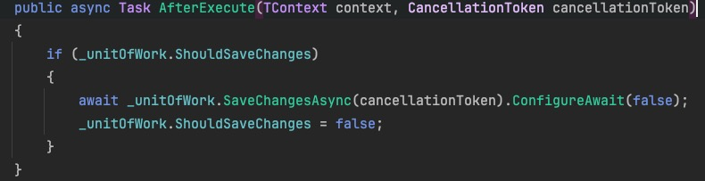

### 1、unit of work 和unify response使用

在autofac的module注册mediator时可以配置开启中间件

在具体实现类中，可以实现：

```
bool ShouldExecute(TContext context, CancellationToken cancellationToken);

Task BeforeExecute(TContext context, CancellationToken cancellationToken);

Task Execute(TContext context, CancellationToken cancellationToken);

Task AfterExecute(TContext context, CancellationToken cancellationToken);

Task OnException(Exception ex, TContext context);
```

5个接口，控制请求经过管道各个阶段的处理方式。

经过unify response管道时对返回的response做了拓展，

针对继承了特定自定义response类进行增强（设置响应码、消息），针对异常统一封装为服务器内部异常返回

经过unit of work管道时，从上下文中注入unitOfWork实例，在执行请求后，判断是否可以保存，提交保存操作



一些repository默认允许保存，在经过unitOfWork中间件时，执行保存

如果不是使用这些方法，记得设置允许保存的属性


#### Mediator集成这两个中间件

##### 创建Unit of work接口用于判断是否需要保存变更到数据库，会交给容器管理

```
public interface IUnitOfWork
{
    Task<int> SaveChangesAsync(CancellationToken cancellationToken = default);
    
    bool ShouldSaveChanges { get; set; }
}
```

自己编写的DbContext类除了继承DbContext类，再多继承IUnitOfWork接口，

便于在注册DbContext服务时一起注册

原来自定义的DbContext中ShouldSaveChanges属性，是继承自IUnitOfWork接口的


##### 创建CommonResponse类继承mediator提供的IResponse，用于同一的response处理

```
public class CommonResponse<T> : CommonResponse
{
    public T Data { get; set; }
}

public class CommonResponse : IResponse
{
    public HttpStatusCode Code { get; set; }

    public string Msg { get; set; }
}
```


##### 创建UnifyResponseMiddleware和UnitOfWorkMiddleWare两个扩展方法类用于指定中间件的实现类

UnitOfWorkMiddleWare：

```c#
public static class UnitOfWorkMiddleWare
{
    public static void UseUnitOfWork<TContext>(this IPipeConfigurator<TContext> configurator,
        IUnitOfWork unitOfWork = null) where TContext : IContext<IMessage>
    {
        if (unitOfWork == null && configurator.DependencyScope == null)
        {
            throw new DependencyScopeNotConfiguredException(
                $"{nameof(unitOfWork)} is not provided and IDependencyScope is not configured, " +
                $"Please ensure {nameof(unitOfWork)} is registered properly if you are using IoC container, " +
                $"otherwise please pass {nameof(unitOfWork)} as parameter");
        }

        unitOfWork ??= configurator.DependencyScope.Resolve<IUnitOfWork>();

        configurator.AddPipeSpecification(new UnitOfWorkSpacification<TContext>(unitOfWork));
    }
}
```

```c#
unitOfWork ??= configurator.DependencyScope.Resolve<IUnitOfWork>();
//这里IUnitOfWork实例由Mediator创建
```


UnifyResponseMiddleware：

```
public static class UnifyResponseMiddleware
{
    public static void UseUnifyResponse<TContext>(this IPipeConfigurator<TContext> configurator)
        where TContext : IContext<IMessage>
    {
        if (configurator.DependencyScope == null)
            throw new ArgumentNullException(nameof(configurator.DependencyScope));

        configurator.AddPipeSpecification(new UnifyResponseSpacification.UnifyResponseSpecification<TContext>());
    }
}
```

##### 创建UnifyResponseSpacification和UnitOfWorkSpacification两个中间件的具体实现类，

在管道生命周期的各个阶段实现增强


##### 在Autofac的module类中，在注册Mediator时配置请求管道，调用之前写的扩展方法开启中间件

```
mediatorBuidler.ConfigureGlobalReceivePipe(x =>
{
    x.UseUnitOfWork();
    x.UseUnifyResponse();
});
```


自定义response类继承统一返回Response，需要提交保存数据变更的地方（比如provider）

注入IUnitOfWork，获取当前上下文的UnitOfWork实例，更改其中的ShouldSaveChanges属性

（也属于Dbcontext，注册时一起注册，跟DbContext一个生命周期）

这样mediator管道后置处理请求时，会调用SaveChangesAsync提交数据变更操作


### 2、coverlet.collector包

`coverlet.collector` 是一个用于收集代码覆盖率信息的命令行工具。它的作用是帮助开发人员和测试人员收集和生成代码的覆盖率报告，以便评估测试的质量和覆盖的程度。

```
<PackageReference Include="coverlet.collector" Version="3.1.2">
​        <PrivateAssets>all</PrivateAssets>
​        <IncludeAssets>runtime; build; native; contentfiles; analyzers; buildtransitive</IncludeAssets>
​      </PackageReference>
```

`<PrivateAssets>all</PrivateAssets>`:

- `PrivateAssets` 元素定义了依赖项在传递时是否应该被排除。
- `all` 表示在传递依赖时，不应包括 `coverlet.collector` 包的任何内容。

`<IncludeAssets>runtime; build; native; contentfiles; analyzers; buildtransitive</IncludeAssets>`:

- `IncludeAssets` 元素定义了哪些资产（assets）应包括在项目中。

- ```
  runtime; build; native; contentfiles; analyzers; buildtransitive
  ```

  - `runtime`: 包含运行时相关的资产。
  - `build`: 包含构建时需要的资产。
  - `native`: 包含与本机代码相关的资产。
  - `contentfiles`: 包含任何内容文件。
  - `analyzers`: 包含分析器相关的资产。
  - `buildtransitive`: 包含所有构建相关的传递性资产。

这样的配置告诉项目系统如何处理 `coverlet.collector` 包的依赖关系和资产，确保在构建和运行时正确包含和排除必要的组件和文件。

### 3、Microsoft.NET.Test.Sdk包

主要用于.NET平台的单元测试和集成测试。

允许在开发过程中运行和管理单元测试和集成测试。

可以识别和执行测试项目中的测试方法，包括使用一些流行的测试框架（如 xUnit、NUnit、MSTest 等）编写的测试。


### 4、NSubstitute包

NSubstitute 是一个用于 .NET 平台的开源库，用于创建和管理 .NET 应用程序中的测试替代品（mocks、stubs 和 fakes）。

可以使用 NSubstitute 设置测试替代品的期望行为，包括定义方法的返回值、抛出异常或模拟方法的执行。同时，你还可以断言测试替代品是否按照预期进行了调用。允许创建递归的测试替代品。


### 5、Shouldly包

Shouldly 是一个.NET 平台上的开源断言库，用于编写更加清晰和表达力强的单元测试。


### 6、集成测试项目配置

```
<ItemGroup>  
<Content Update="appsettings.json">    
<ExcludeFromSingleFile>true</ExcludeFromSingleFile>    <CopyToOutputDirectory>PreserveNewest</CopyToOutputDirectory>    <CopyToPublishDirectory>PreserveNewest</CopyToPublishDirectory>  
</Content> 
</ItemGroup>
```

**ExcludeFromSingleFile**: `<ExcludeFromSingleFile>true</ExcludeFromSingleFile>` 指定是否将此内容项排除在单文件发布（single file publish）之外。单文件发布是.NET 5及更高版本中引入的功能，允许将应用程序及其依赖项打包为单个可执行文件。

**CopyToOutputDirectory**: `<CopyToOutputDirectory>PreserveNewest</CopyToOutputDirectory>` 指定将 `appsettings.json` 文件复制到输出目录时的行为。`PreserveNewest` 表示只有当文件比输出目录中的文件更新时，才会复制该文件。

**CopyToPublishDirectory**: `<CopyToPublishDirectory>PreserveNewest</CopyToPublishDirectory>` 类似于 `CopyToOutputDirectory`，但是用于发布目录。指定了在发布时将 `appsettings.json` 复制到发布目录时的行为，这里也是 `PreserveNewest`，即保留更新的文件。