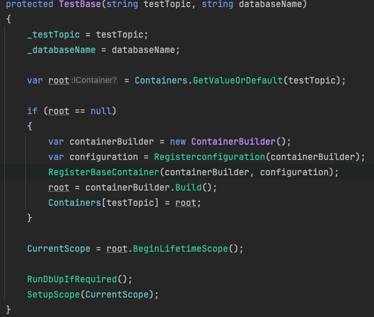
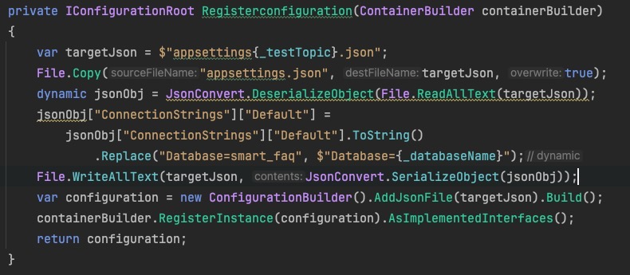

### 1、SaveChangesAsync

Mediator 的IUnitofWork的SaveChangesAsync底层调用的是DbContext的saveChanges


### 2、集成测试

#### 测试相关包

Autofac

coverlet.collector

Microsoft.NET.Test.Sdk

NSubstitute

Shouldly

xunit


#### 创建TestUtilBase基类，TestUtil类继承基类

功能：

TestUtil的ReadJsonFileFromResource方法可以读取本地文件配置

可以调用TestUtilBase的SetupScope方法，设置Autofac容器的作用域


TestUtilBase类

TestUtilBase的SetupScope方法，用于设置Autofac容器的作用域。可以被TestUtil和TestBase调用该方法用于设置当前容器上下文


TestUtilBase还提供了一系列RunXxx的泛型方法，泛型指定类要获取的服务类型

方法创建子容器，获取了服务实例并执行相应的操作

例子：

```
protected async Task Run<T>(Func<T, Task> action, Action<ContainerBuilder> extraRegistration = null)
{
    var dependency = extraRegistration != null
        ? _scope.BeginLifetimeScope(extraRegistration).Resolve<T>()
        : _scope.BeginLifetimeScope().Resolve<T>();
    await action(dependency);
}
```

```
await Run<IRepository>(async repository =>
{
    var beforeCreateFood = await repository.CountAsync<Foods>(x => true).ConfigureAwait(false);

    beforeCreateFood.ShouldBe(0);

    await _foodsUtil.CreateFoodAsync(food);

    var afterUpdateFood = await repository.FirstOrDefaultAsync<Foods>(i => i.Name.Equals("mike")).ConfigureAwait(false);
    
    afterUpdateFood?.Color.ShouldBe("white");
    afterUpdateFood?.Name.ShouldBe("mike");
});
```

传入了lambda格式的委托，获取IRepository的服务实例，并执行相应的数据库操作和断言来完成测试。


#### 创建基类XxxBase类用于XxxFixture类继承使用

创建TestBase partial类继承TestUtilbase类实现IAsyncLifetime、IDisposable接口，


创建另一个TestBase.Initial partial类，用于实现TestBase调用的方法（跟初始化、后置处理有关）


TestBase类



构造函数根据传入的参数初始化testTopic和databaseName两个属性

尝试根据testTopic从类中的静态成员变量Containers集合中取到autofac容器

如果根据传入的testTopic取不到容器，

则先调用在TestBase.Initial定义的Registerconfiguration方法，传入autofac的ContainerBuilder参数



该方法读取类路径下的`_testTopic`属性值后缀的appsetting配置文件，构建configuration并注册获取实例返回


然后再调用在TestBase.Initial定义的RegisterBaseContainer方法，

传入containerBuilder和拿到的configuration实例


该方法先注册了autofac的module，再注册了NSubstitute创建的代理对象


回到调用出，再通过containerBuilder.Build()构建出autofac容器，存入Containers静态集合中

```
root = containerBuilder.Build();
Containers[testTopic] = root;
```


通过容器创建子容器并赋值给属性中的集合

```
CurrentScope = root.BeginLifetimeScope();

RunDbUpIfRequired();
SetupScope(CurrentScope);
```


RunDbUpIfRequired()则是在TestBase.Initial定义的用于执行DbUp脚本的方法


shouldRunDbUpDatabases静态集合根据传入的_databaseName获取布尔类型值，

如果有该_databaseName，则返回对应的布尔值，执行过脚本为false，该行直接返回，不启动DbUp

没有该_databaseName则返回指定的默认值true，该行继续执行，

传入configuration服务创建ConnectionString对象，启动DbUp，并标记该数据库脚本已执行


除此之外因为TestBase还继承了IAsyncLifetime、IDisposable接口

`IAsyncLifetime` 接口定义了两个异步方法：`InitializeAsync()` 和 `DisposeAsync()`。

`InitializeAsync()` 方法用于在对象实例化之后立即执行异步初始化操作。

`DisposeAsync()` 方法则在对象销毁之前执行异步清理操作。

`IDisposable`接口定义了一个方法 `Dispose()`，使用`using` 语句来自动调用实现了 `IDisposable` 接口的对象的 `Dispose()` 方法。


TestBase.Initial的实现

```
public Task DisposeAsync()
{
    return Task.CompletedTask;
}
```

```
public void Dispose()
{
    ClearDatabaseRecord();
}
```


清理数据库ClearDatabaseRecord()方法实现：


先从当前的configuration服务取到ConnectionString创建数据库连接

在名为_databaseName的数据库中查询所有表名

根据_tableRecordsDeletionExcludeList这个集合排除不需要执行清理的数据库

使用deleteStatements字符串集合拼接sql字符串

最后拼接完成后执行


#### 创建XxxFixtureBase类，继承TestBase类

```
[Collection("food Tests")]
public class FoodFixtureBase : TestBase
{
    protected FoodFixtureBase() : base("_food_", "Test")
    {
    }
}
```

[Collection("food Tests")]用于组织和分组测试类，以便更好地管理和执行单元测试。

调用了父类的构造方法指定了_testTopic和 _databaseName


创建XxxUtil类继承TestUtil类

调用父类构造函数传入当前的容器上下文

创建一系列用于测试类的方法例如

```
public async Task<CreateFoodResponse> CreateFoodAsync(CreateFoodDto food)
{
    return await RunWithUnitOfWork<IMediator, CreateFoodResponse>(async mediator =>
    {
        var response = await mediator.SendAsync<CreateFoodCommand, CreateFoodResponse>(
            new CreateFoodCommand { Food = food }); 
        
        return response;
    });
}
```


创建XxxFixture、XxxFixture.Review、XxxFixture.Exception三个partial类，继承XxxFixtureBase类

XxxFixture类：

```
private readonly FoodsUtil _foodsUtil;

public FoodFixture()
{
    _foodsUtil = new FoodsUtil(CurrentScope);
}
```

构造函数创建Fixture类对应的Util类


XxxFixture.Review和XxxFixture.Exception则是两个针对性不同的测试类

