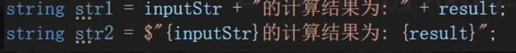
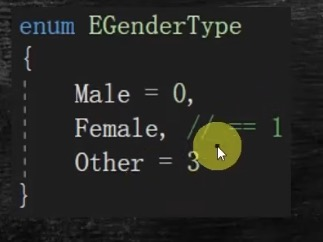
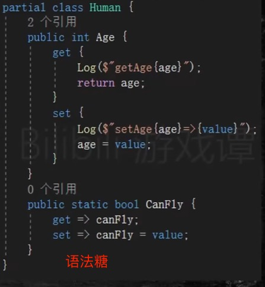
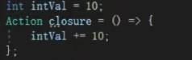

1、Git Flow

master 分支 稳定版本

dev 分支 master拉出来的主要开发分支

feature 分支 dev分支拉出来的功能特性分支

release 分支 dev分支拉出来的发布分支，作为上线前的测试分支

hotfix 分支 master分支拉出来的热修复分支，作为上线产品紧急修复分支

2、PR Pull Request

用于code review控制代码质量

review后再进行合并分支 PR尽量小而精

3、CI/CD 持续集成持续部署

提交代码合并后，自动化运行打包构建镜像，把镜像部署到不同生产环境

octopus deploy 持续集成 还有配置中心可以针对不同生产环境进行配置

4、c#学习

包管理器是 NuGet。 它类似于 java中的Maven

(1) 数据类型

int 有符号整型 4字节 有符号32 位整数

Unit  无符号整型 4字节 无符号32 位整数

sbyte 一半是负数 8位整数

short 16

long 64

char 2字节 存储单个字符 底层是char数组 大小不可变

字符串数值转换

int.Parse(变量) 

123.ToString()

默认小数是双精度double 

字符串拼接



枚举类型 成员不赋值默认按上一个成员的值递增



枚举类型强转


continue和break同java用法

int[] ary = new int[] {1,2,3} 初始化语法

(2)结构 类

结构是值类型，它在栈中分配空间；而类是引用类型，它在堆中分配空间，栈中保存的只是引用。都默认继承自object，是所有类型的终极父类

被函数访问修改时，结构深拷贝，类浅拷贝，如果需要结构类型也被修改需要使用关键字ref

描述一个轻量级对象的时候，结构可提高效率（直接访问数值地址，不需要垃圾回收），成本更低。不过假如我们在传值的时候希望传递的是对象的引用地址而不是对象的拷贝，就应该使用类

class默认成员变量是 private的

定义常量用 const 

partial 关键字  用于将一个类、结构体、接口或方法分割成多个部分，允许你在不同的文件中定义同一个实体的不同部分，需要确保每个部分的访问修饰符、方法签名等保持一致

方法签名：方法名称 + 参数个数、类型、顺序

property 属性 看起来像访问成员变量实际是函数调用




(3)继承 

Class B: A{

}  代表B类继承自A，继承属性和方法

父类声明protected 变量 子类和自己能访问 实例不能访问

父类声明 virtual 方法，子类可对该方法 用override进行覆盖

struct 不能继承struct 或 class 但可以继承接口

class 可以继承一个或零个基类 (单继承) 可以继承任意多个接口

(4)接口

接口只声明函数，不能给函数加修饰符

(5)==、Equals、ReferenceEquals

https://juejin.cn/post/6844904067332833293

(6)泛型

可以对泛型参数进行约束

(7)容器

List 动态数组

Dictionary 键值队

dic[key值] = value 修改对应的value值 

dict.TryGetValue(key, out string val) 如果存在则把key对于的value赋给val

并从容器中去除

dict.Keys dict.Values

HashSet 唯一性

(8)delegate 关键字 用于保存多个函数指针 

保存的函数进行回调时会按保存顺序依次调用

 Action 无返回值类型的delegate

Func 有返回值类型的delegate



(9)匿名函数

匿名函数操作变量会引用上下文同名变量 闭包

(10)attribution

TODO

(11)反射

TODO
(12)宏

在using前定义

#if 定义了对应宏执行后续代码 #else #endif 结束

(13)所有异常基类Exception

(14)扩展方法

```csharp
namespace ExtensionMethods
{
    public static class MyExtensions
    {
        public static int WordCount(this string str)
        {
            return str.Split(new char[] { ' ', '.', '?' },
                             StringSplitOptions.RemoveEmptyEntries).Length;
        }
    }
}
```

可使用此 `WordCount` 指令将 `using` 扩展方法置于范围中：

```csharp
using ExtensionMethods;
```

而且，可以使用以下语法从应用程序中调用该扩展方法：

```csharp
string s = "Hello Extension Methods";
int i = s.WordCount();
```