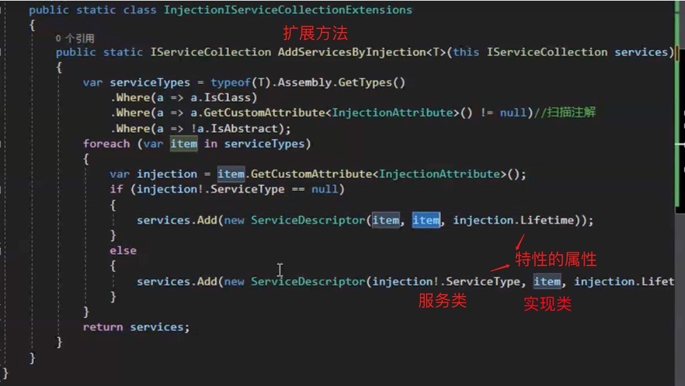
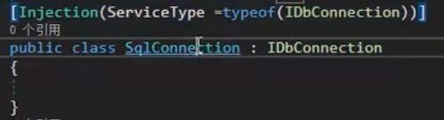

[TOC]

## 1、视频教程推荐

【跟我一起 掌握AspNetCore底层技术和构建原理】 https://www.bilibili.com/video/BV1W14y1c7yt/?p=2&share_source=copy_web&vd_source=b69355dc60bedf312efdb1441ec8dcb6

ioc、configuration、logging、aop、asp


## 2、验证容器配置

创建容器时 ValidateOnBuild = true 

可以让应用启动编译时检查被依赖的服务是否已注册、是否循环依赖

避免在运行时出现异常

如果使用autofac默认是开启的


通过根容器（创建的第一个IServiceProvider）创建Scope类型的实例，

会导致scope不能释放，要通过子容器创建，如：`container.CreateScope().ServiceProvider.GetRequiredService<T>();`


## 3、ActivatorUtilities工具类

`ActivatorUtilities` 类会利用依赖注入容器中注册的服务提供程序来解析构造函数所需的服务依赖。

`T instance = ActivatorUtilities.CreateInstance<T>(serviceProvider, arguments);`


## 4、通过扫描类注册程序集下的服务

可以通过自定义特性，在特性中使用扩展方法扩展 IServiceCollection，指定泛型

通过该泛型扫描该类型程序集下的服务并注册

自定义特性：






##  5、单例工厂模式创建实例

⚠️使用单例工厂模式创建实例，传入的是根容器，

工厂创建的实例如果是多例的或依赖了多例的实例，则会报错

也不能在工厂内再创建子容器创建Scope，因为工厂是单例的


## 6、null 合并运算符

```
result = expression1 ?? expression2;
```

它的行为解释如下：

- 如果 `expression1` 的值不为 null，则 `result` 将被赋值为 `expression1` 的值。
- 如果 `expression1` 的值为 null，则 `result` 将被赋值为 `expression2` 的值


## 7、.ConfigureAwait(false);

`.ConfigureAwait(false)` 被添加在异步方法后，异步方法执行后不会尝试恢复到调用线程的上下文环境中。这对于数据库查询等大量 I/O 操作来说，能够减少不必要的线程切换开销，提升系统的整体性能。


