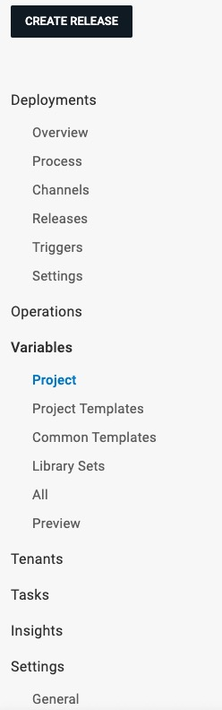

#### 学习octopus的使用

提前部署Octopus Server、制作发布应用镜像、

#### Infrastructure模块

在Deployment Targets中配置要部署package或者容器到什么地方，比如物理服务器、虚拟机、云服务中的实例或 Kubernetes 群集中的节点

##### 新建Deployment Targets

选择要部署目标的类型，支持windows、linux、Mac、azure、k8s等

其中部署到一些环境需要目标环境安装Octopus Tentacle，一个轻量级agent服务，用来跟octopus通信

Octopus Server 可以通过 SSH 与Linux、mac通信，不用安装Tentacle agent

Octopus Tentacle可以配置两种不同的通信方式与 Octopus Server进行连接：轮询模式和监听模式。

Machine policies是一组设置，可以应用于 Tentacle 和SSH endpoints 。它们可用于：

自定义health checks的间隔。

运行自定义health checks脚本。

忽略health checks期间不可用的Machine。

配置 Calamari 和 Tentacles 以及 SSH Targets 的更新方式。

使用Tentacle从通信错误中恢复。

自动删除机器。

可以给Deployment Targets添加不同的role，比如数据库服务器、Web 服务器、应用服务器等角色

指定Environments 如dev、test、uat、prd等环境

workers、worker pool

workers是一些部署在windows、linux、mac机器中的一些用于执行任务的计算节点

Octopus Deploy 将部署和运维任务分发给 Deployment Targets 和 Workers。一般来说，简单的部署任务（如文件复制、配置更改等）通常会直接在 Deployment Targets 上执行，因为这些任务可以在目标环境中快速完成。

对于复杂或耗时的任务（如安装软件、运行集成测试、执行长时间脚本等），Octopus Deploy 可以选择将这些任务分发给 Workers。Workers 可能会比 Deployment Targets 配置更高的计算资源或专用的环境，从而提高任务执行的效率和可靠性

#### Library模块

通过External Feeds可以从team city、docker registry、nuget、github等远程托管中获取到package

比如team city需要添加一个nuget feed并使用已授权的URL来作为octopus中的External feed

详见[team city生成nuget feed](https://www.jetbrains.com/help/teamcity/using-teamcity-as-nuget-feed.html#Enabling+NuGet+Feed)

或者在team city build step中直接通过url和apikey 索引构建输出的package来推送

从以上网站推送的package会被存储在octopus的服务器本地路径中

还可以推送到octopus的内置仓库

可以设置一些step templates（还可以查看哪些project引用了这个模版，进行版本控制）

和Variable Sets（可以指定使用变量的Scope 比如dev、test）

可以在Certificates 上传和关联数字证书到部署中

还可以在Lifecycles，定义project要经历哪些environments的部署和发布

##### 定义process

新建project

项目空间 -> 新建项目 ->选择Project Group -> 选择Lifecycle -> 保存

在process中添加Deployment steps，定义了如发送消息，初始化运行环境、将package部署到Deployment Targets中等一系列步骤，其中一部分操作不是由Deployment Targets执行的，而是由定义的worker执行

在定义step时，开启Configuration features 针对不同环境使用不同的配置文件

在Variables 设置引用变量

每个step都有Conditions可以设置

在worker中执行的step，可以使用docker镜像来执行这个step

在process添加step时，选择**Execution Location**为**Run on a worker**

在**Container Image** 选择**Run inside a container on a worker**然后选择一个container registry和对应镜像名

可以在第一步或最后一步step添加approval

Deploying releases

在releases中选择对应的environment进行deploy，支持延时部署

疑问没有看到设置trigger，只设置了neget feed、docker registry等，也没有在team city使用octo deploy

这时需要手动部署吗？