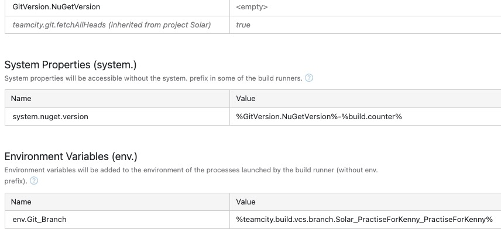
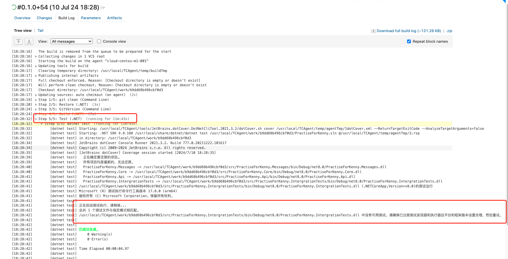

team city构建补充

设置 Artifact paths 为 `**/output/*.nupkg` 的意思是，将从任意子目录中名为 `output` 的目录中找到并收集所有 `.nupkg` 文件作为构建的 Artifact。 （在agent中的目录）

添加一些参数

build前，要选择应用对应环境的agent进行构建

出现问题：build进行要test这一步时卡住

出现问题：测试用例同时执行断言异常，单独执行通过

这是因为在一个Fixture中的不同partial类虽然编写了两个[Fact]方法，但是在Fixture类被回收时才会调用dispose方法去执行里面清理数据库的代码，所以同一个Fixture中不同[Fact]用例对数据库是互相影响的，而且不同[Fact]方法是并行的会对断言结果造成不确定影响