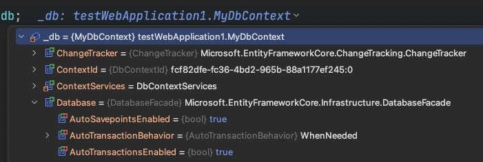

#### 最小托管模型创建应用

```c#
using Autofac;
using Autofac.Extensions.DependencyInjection;
using testWebApplication1.Module;

var configuration = new ConfigurationBuilder()
    .AddJsonFile("appsettings.json")
    .AddEnvironmentVariables()
    .Build();

Host.CreateDefaultBuilder(args)
    .UseServiceProviderFactory(new AutofacServiceProviderFactory())
    .ConfigureWebHostDefaults(x =>
    {
        x.ConfigureServices(x =>
        {
            x.AddAuthorization();
            x.AddControllers();
        });
        
        x.Configure( (context, app) =>
        {
            var env = context.HostingEnvironment;
            if (!env.IsDevelopment())
            {
                app.UseExceptionHandler("/Home/Error");
                
                app.UseHsts();
            }
            
            app.UseStaticFiles();
            app.UseRouting();
            app.UseAuthorization();
            app.UseEndpoints(endpoints =>
            {
                endpoints.MapControllers();
            });
        });
    })
    .ConfigureContainer<ContainerBuilder>(builder =>
    {
        builder.RegisterModule(new MyModule(configuration, typeof(MyModule).Assembly));
    })
    .Build().Run();
```


#### 创建一个测试应用，测试手动开启事务对hangfire任务的影响

测试代码：

```c#
[ApiController]
[Route("api/[controller]")]
public class FoodsController : ControllerBase
{
    private readonly MyDbContext _db;

    public FoodsController(MyDbContext db)
    {
        _db = db;
    }

    [Route("foods"), HttpGet]
    public async Task<IActionResult> GetAllFoodsAsync([FromQuery] FoodRequest request)
    { 
        await using var transaction =  await _db.Database.BeginTransactionAsync();
        
        try
        {
            var food = new Foods
            {
                Id = request.Id,
                Name = request.Name,
                Color = request.Color
            };
            
            BackgroundJob.Enqueue<MyJob>(x => x.DelayPrint(food));
            
            await transaction.CommitAsync().ConfigureAwait(false);
            
            return Ok();
        }
        catch (Exception e)
        {
            await transaction.RollbackAsync().ConfigureAwait(false);
            throw;
        }
    }
}
```

任务类：

```c#
public class MyJob
{
    private readonly MyDbContext _db;

    public MyJob(MyDbContext db)
    {
        _db = db;
    }

    [AutomaticRetry(Attempts = 1)]
    public void DelayPrint(Foods food)
    {
        Thread.Sleep(5000);
        _db.Set<Foods>().Add(food);
        
        throw new Exception("模拟抛出异常");
        
        _db.SaveChanges();
        
        Console.WriteLine("task exit!");
    }
}
```


事务是基于DbContext的，当前项目DbContext生命周期是LifeTimeScope

任务中注入的DbContext


执行入队操作的类中的DbContext


随后每次任务重试，发现DbContext使用的都是同一个，但其实这是hangfire实例任务类时创建的DbContext，只是因为LifeTimeScope导致看起来同一个DbContext，与用户请求进来时创建的DbContext不一样，执行定时任务时，Controller中开启的事务已经提交

任务中之所以会回滚，是因为EFcore默认为调用了saveChanges的当前DbContext开启了事务，将saveChanges当前行的前面所有更改提交

如果多次调用saveChanges，期间抛出异常也会导致数据不一致

详见DbContext实例中的AutoTransactionBehavior变量中的WhenNeeded注释




#### Stopwatch类

`Stopwatch` 是 .NET 中的一个类，用于测量时间间隔。它通常用于代码性能测试、计时和其他需要精确时间测量的场景。`Stopwatch` 提供了高精度的计时功能，适用于需要精确测量的任务。

以下是 `Stopwatch` 类的主要用途和一些示例：

主要用途

1. **性能测试**：测量代码块或函数执行的时间，帮助开发人员识别性能瓶颈。
2. **计时**：用于游戏、动画或其他需要精确计时的应用程序。
3. **日志记录**：记录操作的持续时间，以便调试和分析。

基本使用示例

以下是如何使用 `Stopwatch` 类来测量代码执行时间的示例：

```c#
using System;
using System.Diagnostics;

class Program
{
    static void Main()
    {
        // 创建一个新的 Stopwatch 实例
        Stopwatch stopwatch = new Stopwatch();

        // 开始计时
        stopwatch.Start();

        // 模拟一些工作，使用 Thread.Sleep 模拟耗时操作
        System.Threading.Thread.Sleep(1000);

        // 停止计时
        stopwatch.Stop();

        // 获取并显示经过的时间
        Console.WriteLine($"Elapsed Time: {stopwatch.ElapsedMilliseconds} ms");
    }
}
```