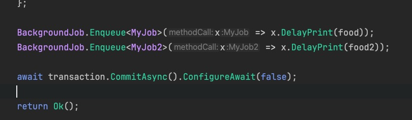

#### JWT token过期时间要用DateTime.UtcNow，避免分布式系统存储的时区问题


#### 测试多个hangfire任务的事务一致性



模拟MyJob抛出异常 MyJob2成功插入数据库

查看事务是否回滚

查看hangfire控制台可以看到，MyJob任务执行失败，MyJob2执行成功，只有MyJob2有数据

此时如果设置了重试次数MyJob进入重试队列，只有重试成功才能保证数据一致性

此时证明在两个任务入队的上下文开启事务，不能保证抛出异常时两个任务操作的回滚


#### 修改测试代码继续测试

```c#
using var transaction = _db.Database.BeginTransaction();

try
{
    food.Name = food.Name + "1";
    _db.Set<Foods>().Add(food);
    _db.SaveChanges();
    
    Thread.Sleep(1000);

    throw new Exception("模拟抛出异常");

    food.Name = food.Name + "2";
    _db.Set<Foods>().Add(food);
    _db.SaveChanges();

    Console.WriteLine("MyJob task exit!");
    
    transaction.CommitAsync().ConfigureAwait(false);
}
catch (Exception e)
{
    transaction.RollbackAsync().ConfigureAwait(false);
  
    Console.WriteLine(e);
  
    throw;
}
```

断点打到Thread.Sleep(1000);时，

执行完毕，发现没有在任务中开启事务的MyJob2成功插入

MyJob任务调用了1次SaveChanges但数据没有插入，说明手动开启事务，SaveChanges调用不会再自动创建事务并提交，手动开启事务时，多次调用SaveChanges没有意义


修改MyJob2也手动开启事务进行测试：

断点打到Thread.Sleep(1000);时，

执行完毕，MyJob2成功插入了，不打断点执行也是MyJob2插入成功

由于MyJob2不会抛出异常，catch块中的回滚方法不会执行


将controller中手动开启的事务注释调再测试：

仍然只有MyJob2数据成功插入


##### 总结

controller中开启的事务对入队的两个任务没有影响，各个任务中抛出异常只会回滚自己当前任务的操作，没有传递性

如果多个任务执行，其中一个任务失败会导致数据不一致，则不考虑把逻辑放到任务中执行


#### xunit数据提供器

[InlineData]、[MemberData] 和 [ClassData]分别从属性、类中的方法、类获取数据


#### string.Equals静态方法支持通过多种规则比较

源码：

```c#
/// <summary>Compare strings using culture-sensitive sort rules and the current culture.</summary>
CurrentCulture,
/// <summary>Compare strings using culture-sensitive sort rules, the current culture, and ignoring the case of the strings being compared.</summary>
CurrentCultureIgnoreCase,
/// <summary>Compare strings using culture-sensitive sort rules and the invariant culture.</summary>
InvariantCulture,
/// <summary>Compare strings using culture-sensitive sort rules, the invariant culture, and ignoring the case of the strings being compared.</summary>
InvariantCultureIgnoreCase,
/// <summary>Compare strings using ordinal (binary) sort rules.</summary>
Ordinal,
/// <summary>Compare strings using ordinal (binary) sort rules and ignoring the case of the strings being compared.</summary>
OrdinalIgnoreCase,
```


#### LINQ筛选器的使用时机

通过在Dbcontext 的OnConfiguring方法配置控制台输出log

```c#
var foodsEnumerable = _db.Set<Foods>().AsEnumerable().Where(x => x.Name == "没有异常的任务");

foreach (var foods in foodsEnumerable)
{
    Console.WriteLine(foods.Name);
}

return Ok();
```

断点打到foreach时，不会立即执行查询，且由于是在AsEnumerable()方法后调用的筛选器，会在查询全部数据后再进行筛选

而使用ToList()方法则会立即查询

在AsEnumerable和ToList之前执行的筛选会添加数据库查询条件

在它们之后执行的筛选是在应用内存中执行的

数据量小的时候可以用AsEnumerable再进行筛选

主要还是注意查询走索引