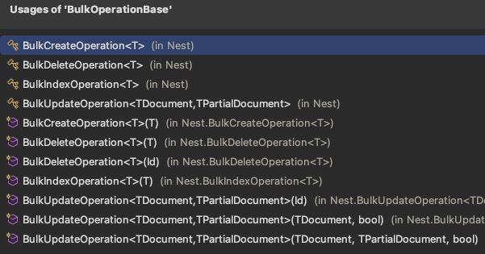

### ES NEST库 索引api

最好不要去索引还没有创建索引的对象，Elasticsearch 会自动创建这个索引并使用动态映射来推断字段类型。动态映射可能会错误地推断数据类型，导致查询和分析问题。而且索引中包含大量不必要的字段，可能会导致映射膨胀，影响性能。


#### 文档索引的批量操作

https://www.elastic.co/guide/en/elasticsearch/client/net-api/7.17/indexing-documents.html


#### IndexManyAsync方法

对多个文档建立索引，不适合非常大的文档集合

在项目中仅在测试方法使用


#### 使用`Bulk`和`BulkAsync`方法并使用描述符来自定义批量调用

```csharp
var asyncBulkIndexResponse = await client.BulkAsync(b => b
    .Index("people")
    .IndexMany(people)
); 
```

在项目中，通过构造BulkDescriptor对象来传递参数调用，而不是使用Fulent API方式

```c#
if (bulkOperation.Count > 0)
{
    var bulkRequest = new BulkRequest(_elasticsearchXxxItemSetting.Value)//索引名
    {
        Operations = bulkOperation
    };
    var response = await _client.BulkAsync(x => bulkRequest, cancellationToken);
    response.CheckIfTheResponseIsInvalid();                
}
```

构造bulkOperation：

```c#
var insertList = _mapper.Map<IEnumerable<ElasticsearchOrderCommentItem>>(orderCommentItemList)
    .Select(x =>
    {
        x.MultiLanguages =
            _mapper.Map<List<ElasticsearchMerchFoodMultiLanguage>>(
                entityLanguages.Where(e => e.EntityId == x.FoodId));
        return new BulkIndexOperation<ElasticsearchOrderCommentItem>(x); //主要将对象封装成BulkIndexOperation类
    });

bulkOperation.AddRange(insertList);
```

其他BulkOperation类型




由于使用Bulk，大量文档是在单个 HTTP 请求中发送的。应该考虑 HTTP 请求的总体大小。

所以对于索引大量文档，执行多个单独的`Bulk`调用或使用[`BulkAllObservable`](https://www.elastic.co/guide/en/elasticsearch/client/net-api/7.17/indexing-documents.html#bulkall-observable)


#### 使用BulkAllObservable和`BulkAll`方法

可以实现索引失败时自动重试/退避的功能，以及控制在单个 HTTP 请求中索引的文档数量的功能。

```c#
var bulkAllObservable = client.BulkAll(people, b => b
    .Index("people")
    .BackOffTime("30s") //设置重试间隔时间为 30 秒
    .BackOffRetries(2) //设置重试次数为 2 次
    .RefreshOnCompleted() //在所有批量操作完成后刷新索引，使其立即可被搜索
    .MaxDegreeOfParallelism(Environment.ProcessorCount)
    .Size(1000) //每个请求将包含 1000 个文档，如果存在大量文档，这可能会导致许多 HTTP 请求
)
.Wait(TimeSpan.FromMinutes(15), next => //执行索引并等待最多 15 分钟，BulkAll 调用是异步的
{
    // do something e.g. write number of pages to console
});
```

BulkAllObservable还有以下方法，可以用来控制流程

- `BufferToBulk`用于在将批量请求分派到服务器之前自定义批量请求中的各个操作
- `RetryDocumentPredicate`用于决定是否应重试索引失败的文档
- `DroppedDocumentCallback`用于确定在文档未编入索引的情况下要执行的操作（即使在重试之后）

详见文档最下方


#### 摄取管道 Ingest Pipelines

https://www.elastic.co/guide/en/elasticsearch/client/net-api/7.17/pipelines.html

可以设置一个管道，可以在索引时指定使用一个管道，可以在数据进入索引之前执行一系列处理步骤，例如重命名字段、修改字段值、删除字段、解析日期等。

```csharp
var indexResponse = client.Index(person, p => p.Index("people").Pipeline("person-pipeline"));
```


### 配置分析器

https://www.elastic.co/guide/en/elasticsearch/client/net-api/7.17/writing-analyzers.html

分析器（Analyzer）是用于文本分析的组件，它将输入文本分解为词元（tokens），这些词元可以用于索引和搜索。分析器通常在索引文档和查询时使用，以确保文本的一致性和提高搜索的准确性。

一个分析器由以下几个部分组成：

1. **字符过滤器（Character Filters）**：在分词之前处理文本，执行一些预处理任务，例如删除HTML标签、替换字符等。
2. **分词器（Tokenizer）**：将文本分解为基础词元。分词器决定了词元的边界。（分析器只能也必须有一个）
3. **词元过滤器（Token Filters）**：在分词之后进一步处理词元，例如将词元转换为小写、删除停用词、词干化等。


通常在索引创建时创建类型映射时或者新增索引字段时，可以在text数据类型上指定分析器。但是不能在已有分析器时添加新分析器或者修改一个字段的分析器，否则已有的索引的数据去搜索不会出现分析器预期结果。需要使用[Reindex API](https://www.elastic.co/guide/en/elasticsearch/reference/7.17/docs-reindex.html)重新索引数据，或者删除再重新索引。


可以使用ES内置的分析器，比如

**standard**：默认的标准分析器，适用于大多数语言。使用 Unicode 文本分割算法。

**simple**：简单分析器，只分隔字母字符，并将所有字符转换为小写。

**whitespace**：以空白字符（空格、制表符等）分词，不修改词元。

**stop**：类似于 `standard` 分析器，但会去除常见的停用词。

**keyword**：不分词，将整个输入作为一个词元。

**pattern**：使用正则表达式进行分词。

**language-specific analyzers**：为特定语言定制的分析器，如 `english`、`french`、`german` 等，它们包括语言特定的字符过滤器、分词器和词元过滤器。


也可以使用自定义的分析器，官方示例：

```c#
var createIndexResponse = _client.Indices.Create("questions", c => c
    .Settings(s => s
        .Analysis(a => a
            .CharFilters(cf => cf //设置自定义的字符过滤器
                .Mapping("programming_language", mca => mca //命名为programming_language
                    .Mappings(new []
                    {
                        "c# => csharp", //将C#和c#分别映射到"CSharp"和"csharp" （因此#不会被分词器剥离）
                        "C# => Csharp"
                    })
                )
            )
            .Analyzers(an => an //设置自定义分析器，命名为question
                .Custom("question", ca => ca 
                    .CharFilters("html_strip", "programming_language") //使用自定义的字符过滤器和内置的html过滤器
                    .Tokenizer("standard") //使用内置的标准分词器
                    .Filters("lowercase", "stop") //使用内置的小写和删除停用词的词元过滤器
                )
            )
        )
    )
    .Map<Question>(mm => mm
        .AutoMap()
        .Properties(p => p
            .Text(t => t
                .Name(n => n.Body)
                .Analyzer("question") //对该字段使用自定义分析器
            )
        )
    )
);
```


官方测试分析器的示例

https://www.elastic.co/guide/en/elasticsearch/client/net-api/7.17/testing-analyzers.html


### ES NEST库 查询api

匹配全部文档 示例

```c#
var searchRequest = new SearchRequest<Project>
{
    Query = new MatchAllQuery()
};

searchResponse = _client.Search<Project>(searchRequest);
```

也可以使用Fluent API用法

```c#
var searchResponse = _client.Search<Project>(s => s
    .Query(q => q
        .MatchAll()
    )
);
```


传入其他参数参见 https://www.elastic.co/guide/en/elasticsearch/client/net-api/7.17/reference-search.html


查询操作通常分为三类

- [Structured search 结构化搜索](https://www.elastic.co/guide/en/elasticsearch/client/net-api/7.17/writing-queries.html#structured-search)
- [Unstructured search 非结构化搜索](https://www.elastic.co/guide/en/elasticsearch/client/net-api/7.17/writing-queries.html#unstructured-search)
- [Combining queries 组合查询](https://www.elastic.co/guide/en/elasticsearch/client/net-api/7.17/writing-queries.html#combining-queries)

可以针对具体用法进行api的学习和调用


比如 Boolean query 布尔查询 https://www.elastic.co/guide/en/elasticsearch/reference/7.17/query-dsl-bool-query.html

 

#### Query and filter context 查询和过滤上下文

详见 https://www.elastic.co/guide/en/elasticsearch/reference/7.17/query-filter-context.html

默认情况下，Elasticsearch 按**相关性得分**对匹配的搜索结果进行排序，相关性得分衡量每个文档与查询的匹配程度。

相关性分数是一个正浮点数，在搜索API 的`_score`数据字段中返回。 `_score`越高，文档的相关性越高。虽然每种查询类型可以以不同的方式计算相关性分数，但分数计算还取决于查询子句是在**查询上下文**中运行还是在**筛选**上下文中运行。


### 查询只返回文档中的部分字段

##### 通过不存储某些字段实现

默认情况下，在索引文档时，Elasticsearch 会将最初发送的 JSON 文档存储在名为 [_source](https://www.elastic.co/guide/en/elasticsearch/reference/7.17/mapping-source-field.html) 的特殊字段中。从搜索查询返回的文档将从每次命中时从 Elasticsearch 返回`的_source`字段具体化。_source存储了字段的原始值

通过在创建映射时，指定对应字段时添加.Store(false)禁用字段的_source存储，比如

```c#
var response = await _client.Indices.CreateAsync(index, i => i.Map<Xxx>(m => m
        .Properties(p => p
            .Keyword(k=>k.Name(n=>n.Id).Store(false))
            ...
```


##### 使用Source filtering 源过滤

```c#
var searchResponse = _client.Search<Project>(s => s
    .Source(sf => sf
        .Includes(i => i //包含
            .Fields(
                f => f.Name,
                f => f.StartedOn,
                f => f.Branches
            )
        )
        .Excludes(e => e //排除
            .Fields("num*") //支持通配符模式
        )
    )
    .Query(q => q
        .MatchAll()
    )
);
```


#### NEST还支持发送滚动请求用于返回大量的文档

https://www.elastic.co/guide/en/elasticsearch/client/net-api/7.17/scrolling-documents.html


### ES中的聚合查询

用法参见 https://www.elastic.co/guide/en/elasticsearch/client/net-api/7.17/reference-aggregations.html

Elasticsearch 中的聚合（Aggregations）功能是一种强大的数据处理工具，用于分析和总结大量数据。通过聚合，可以从大规模数据集中提取统计信息、趋势、分布等有用信息，而不仅仅是简单的搜索和检索。

Elasticsearch 提供了多种类型的聚合，每种聚合适用于不同的分析需求。常见的聚合类型包括：

1. **度量聚合（Metric Aggregations）**：计算单个值，如平均值、总和等。
   - `avg`：计算平均值。
   - `sum`：计算总和。
   - `max`：计算最大值。
   - `min`：计算最小值。
   - `cardinality`：计算唯一值的数量。
2. **桶聚合（Bucket Aggregations）**：将文档分组到桶中，每个桶代表一个数据子集。
   - `terms`：按特定字段的值进行分组。
   - `histogram`：按数值范围进行分组。
   - `date_histogram`：按时间范围进行分组。
   - `range`：按特定范围进行分组。
3. **嵌套聚合（Nested Aggregations）**：支持在一个聚合中嵌套另一个聚合，实现多级聚合。
4. **管道聚合（Pipeline Aggregations）**：基于其他聚合的结果进行进一步计算。
   - `derivative`：计算派生值。
   - `moving_avg`：计算移动平均值。


项目中的应用可以参考IElasticsearchMerchFoodService.cs中GetEvenlyDistributedMerchantFoodIdsByName方法

使用了桶聚合和terms聚合进行分组查询，并使用size限制返回桶的数量，最外层查询使用size(0)表示不关心返回的文档而是聚合的结果

并从聚合结果中提取需要的数据