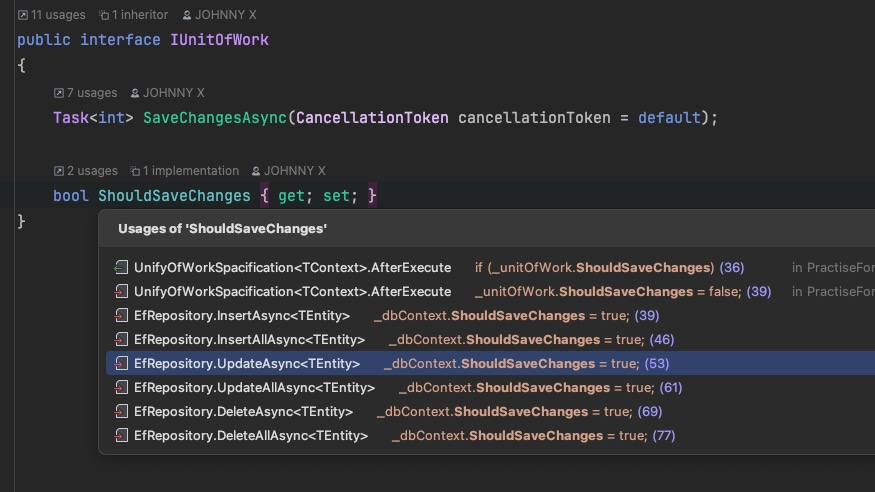

### unit of work 和unify response使用

在autofac的module注册mediator时可以配置开启中间件

在具体实现类中，可以实现：

```
bool ShouldExecute(TContext context, CancellationToken cancellationToken);

Task BeforeExecute(TContext context, CancellationToken cancellationToken);

Task Execute(TContext context, CancellationToken cancellationToken);

Task AfterExecute(TContext context, CancellationToken cancellationToken);

Task OnException(Exception ex, TContext context);
```

5个接口，控制请求经过管道各个阶段的处理方式。

经过unify response管道时对返回的response做了拓展，

针对继承了特定自定义response类进行增强（设置响应码、消息），针对异常统一封装为服务器内部异常返回

经过unit of work管道时，从上下文中注入unitOfWork实例，在执行请求后，判断是否可以保存，提交保存操作


一些repository默认允许保存，在经过unitOfWork中间件时，执行保存

如果不是使用这些方法，记得设置允许保存的属性




#### Mediator集成这两个中间件

##### 创建Unit of work接口用于判断是否需要保存变更到数据库，会交给容器管理

```
public interface IUnitOfWork
{
    Task<int> SaveChangesAsync(CancellationToken cancellationToken = default);
    
    bool ShouldSaveChanges { get; set; }
}
```

自己编写的DbContext类除了继承DbContext类，再多继承IUnitOfWork接口，

便于在注册DbContext服务时一起注册

原来自定义的DbContext中ShouldSaveChanges属性，是继承自IUnitOfWork接口的


##### 创建CommonResponse类继承mediator提供的IResponse，用于同一的response处理

```
public class CommonResponse<T> : CommonResponse
{
    public T Data { get; set; }
}

public class CommonResponse : IResponse
{
    public HttpStatusCode Code { get; set; }

    public string Msg { get; set; }
}
```


##### 创建UnifyResponseMiddleware和UnitOfWorkMiddleWare两个扩展方法类用于指定中间件的实现类

UnitOfWorkMiddleWare：

```c#
public static class UnitOfWorkMiddleWare
{
    public static void UseUnitOfWork<TContext>(this IPipeConfigurator<TContext> configurator,
        IUnitOfWork unitOfWork = null) where TContext : IContext<IMessage>
    {
        if (unitOfWork == null && configurator.DependencyScope == null)
        {
            throw new DependencyScopeNotConfiguredException(
                $"{nameof(unitOfWork)} is not provided and IDependencyScope is not configured, " +
                $"Please ensure {nameof(unitOfWork)} is registered properly if you are using IoC container, " +
                $"otherwise please pass {nameof(unitOfWork)} as parameter");
        }

        unitOfWork ??= configurator.DependencyScope.Resolve<IUnitOfWork>();

        configurator.AddPipeSpecification(new UnitOfWorkSpacification<TContext>(unitOfWork));
    }
}
```

```c#
unitOfWork ??= configurator.DependencyScope.Resolve<IUnitOfWork>();
//这里IUnitOfWork实例由Mediator创建
```


UnifyResponseMiddleware：

```
public static class UnifyResponseMiddleware
{
    public static void UseUnifyResponse<TContext>(this IPipeConfigurator<TContext> configurator)
        where TContext : IContext<IMessage>
    {
        if (configurator.DependencyScope == null)
            throw new ArgumentNullException(nameof(configurator.DependencyScope));

        configurator.AddPipeSpecification(new UnifyResponseSpacification.UnifyResponseSpecification<TContext>());
    }
}
```

##### 创建UnifyResponseSpacification和UnitOfWorkSpacification两个中间件的具体实现类，

在管道生命周期的各个阶段实现增强


##### 在Autofac的module类中，在注册Mediator时配置请求管道，调用之前写的扩展方法开启中间件

```
mediatorBuidler.ConfigureGlobalReceivePipe(x =>
{
    x.UseUnitOfWork();
    x.UseUnifyResponse();
});
```


自定义response类继承统一返回Response，需要提交保存数据变更的地方（比如provider）

注入IUnitOfWork，获取当前上下文的UnitOfWork实例，更改其中的ShouldSaveChanges属性

（也属于Dbcontext，注册时一起注册，跟DbContext一个生命周期）

这样mediator管道后置处理请求时，会调用SaveChangesAsync提交数据变更操作


### SaveChangesAsync

Mediator 的IUnitofWork的SaveChangesAsync底层调用的是DbContext的saveChanges

