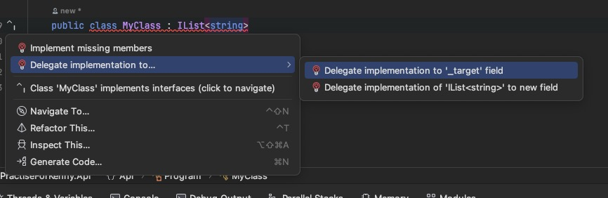
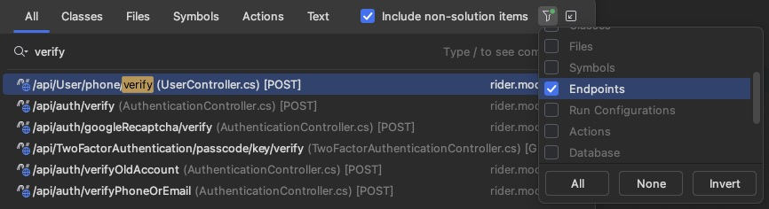

⚠️`ToArray()`和`ToList()`方法返回的数组和列表是浅拷贝，而不是深拷贝。

大量操作，用linq会可能会产生性能问题


using不加大括号作用域扩大，在写入文件时可能会造成资源占用


成员变量默认是private的，类默认是internal的


安装MySql踩坑

8.4.0 使用MacOs 安装时，会出现服务器启动失败一直重试

打开mysql偏好设置取消勾选 Keyring Data File


快速增强接口




#### 方法调用优先级

```
interface IInterface
{
    void Method();
}

class BaseClass
{
    public void Method()
    {
        Console.WriteLine("BaseClass.Method() called");
    }
}

class DerivedClass : BaseClass, IInterface
{
    // DerivedClass 继承了 BaseClass 并实现了 IInterface，但没有显式实现 Method 方法
}

DerivedClass obj = new DerivedClass();
obj.Method();  // 输出: BaseClass.Method() called
```

当一个类继承了另一个类和一个接口，并且继承的类中有与接口中同名的方法，但没有显式实现接口中的方法时，直接调用该方法会调用继承类中的方法。

这种行为符合面向对象编程中的方法调用优先级规则，即类中定义的方法优先于接口中的默认实现。


#### 中文乱码

忘记设置数据库字符集导致DbUp插入脚本中文乱码，修改后仍乱码

在ConnectionString后添加Charset=utf8mb4，脚本插入中文正常


dbContext.Update()如果传入实体主键为类型的默认值，会执行插入操作

addOrUpdate的逻辑时，记得把id映射到待修改的实体上


编写测试用例时RunWithUnitOfWork方法调用结束后才会调用saveChanges，可以分开几次调用


rider在尝试fetch时需要登陆公司gitlab，但是使用了rider内置插件后强制要求使用token，由于是私有仓库，不能使用token登陆，可以先禁用gitlab插件，在使用账号密码登陆，要使用插件再打开，不影响登陆状态


双击shift搜索定位controller方法 （也可以筛选endpoint）


