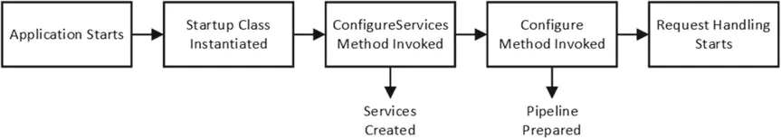
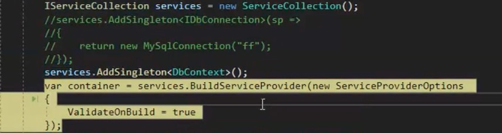
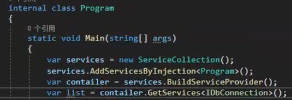

#### 1、项目结构

| 目录/文件                      | 说明                                                         |
| ------------------------------ | ------------------------------------------------------------ |
| 依赖项                         | ASP.NET Core 开发、构建和运行过程中的依赖项，一般都是 NuGet 包和一些 SDK |
| Properties                     | 配置，存放了一些 .json 文件用于配置 ASP.NET Core 项目        |
| Propertics/launchSettings.json | 启动配置文件，为一个 ASP.NET Core 应用保存特有的配置标准，用于应用的启动准备工作，包括环境变量，开发端口等 |
| wwwroot                        | 网站跟目录，存放类似于 CSS、JS 和图片、还有 HTML 文件等静态资源文件的目录 |
| Program.cs                     | 这个文件包含了 ASP.NET Core 应用的 Main 方法，负责配置和启动应用程序 |
| Startup.cs                     | Startup.cs 文件是 ASP.NET Core 的项目的入口启动文件          |

#### 2、项目启动流程

ASP .net Core 6 以前的项目创建时会自动建立Program.cs和Startup.cs两个类文件

Program.cs 作为 Web应用程序的默认入口，不做任何修改的情况下，会调用同目录下 Startup.cs 中的 ConfigureServices 方法 和 Configure 方法。

应用启动流程：



#### 3、验证容器配置

创建容器时 ValidateOnBuild = true 

可以让应用启动编译时检查被依赖的服务是否已注册、是否循环依赖

避免在运行时出现异常

如果使用autofac默认是开启的



通过根容器（创建的第一个IServiceProvider）创建Scope类型的实例，

会导致scope不能释放，要通过子容器创建，如：`container.CreateScope().ServiceProvider.GetRequiredService<T>();`


#### 4、ActivatorUtilities工具类

`ActivatorUtilities` 类会利用依赖注入容器中注册的服务提供程序来解析构造函数所需的服务依赖。

`T instance = ActivatorUtilities.CreateInstance<T>(serviceProvider, arguments);`


#### 5、通过扫描类注册程序集下的服务

可以通过自定义特性，在特性中使用扩展方法扩展 IServiceCollection，指定泛型

通过该泛型扫描该类型程序集下的服务并注册

自定义特性：




#### 6、单例工厂模式创建实例

⚠️使用单例工厂模式创建实例，传入的是根容器，

工厂创建的实例如果是多例的或依赖了多例的实例，则会报错

也不能在工厂内再创建子容器创建Scope，因为工厂是单例的


#### 7、HttpContext用法

ControllerBase类中提供了HttpContext、Request、Response等属性，可以直接获取和设置值

```
var userAgent = request.Headers.UserAgent;    
var customHeader = request.Headers["x-custom-header"];    
return Results.Ok(new { userAgent = userAgent, customHeader = customHeader });
```


#### 8、配置标签用法

\<Compile Remove="FolderToRemove\**\*.cs" />

项目文件列表中移除源代码文件，并不会物理删除文件。被移除的文件不会参与编译和生成过程

\<EmbeddedResource Remove="..." /> 主要用于管理项目中要嵌入到生成的程序集中的资源文件。

\<None Remove="..." />  用于项目中的其他文件，通常是配置文件、文档、图像等，不会被编译、嵌入为资源，也不会被包含在生成的程序集中

\<CopyToOutputDirectory>主要用于控制项目构建时文件的复制行为，即输出到 bin 目录或调试/发布目录。

\<CopyToPublishDirectory> 主要用于控制项目发布时文件的复制行为，即输出到最终发布目录。


#### 9、IStartupFilter添加自定义中间件并调整执行顺序

在ConfigureServices中向IServiceCollection注册IStartupFilter

services.AddTransient<IStartupFilter, MyStartupFilter>();

在IStartupFilter自己的Configure方法中向IApplicationBuilder配置中间件

app.UseMiddleware\<MyCustomMiddleware>();

这样配置的IStartupFilter中间件，会在UseRouting和UseEndpoints等内置中间件之后执行

如果直接在Startup.Configure中配置中间件则能控制执行顺序在其他中间件之前


多个IStartupFilter实现的中间件要控制顺序，按IStartupFilter在服务容器中注册的顺序来控制


#### 10.net 构建主机流程

在应用程序启动时，首先会通过 `WebHostBuilder` 或 `HostBuilder` 创建和配置主机。

在这个过程中，会调用 `ConfigureServices` 方法来注册应用程序的服务，这些服务包括应用程序需要的各种依赖关系和组件。

`IServiceCollection` 接口提供了一系列方法，如 `AddTransient`、`AddScoped`、`AddSingleton` 等，用于向依赖注入容器注册服务。这些服务可以是应用程序自定义的服务，也可以是框架提供的服务。


完成服务的注册后，接下来会调用 `Configure` 方法来配置应用程序的请求处理管道。

`IApplicationBuilder` 接口提供了一系列方法，如 `UseMiddleware`、`UseRouting`、`UseEndpoints` 等，用于按照顺序配置中间件，从而定义 HTTP 请求的处理流程。


#### 11.获取httpContext

服务实现类方法参数添加ServerCallContext context

​        var httpContext = context.GetHttpContext();


#### 12、获取当前登陆用户信息

在AuthenticationHandler中认证成功后封装AuthenticateResult返回

同时通过Request.HttpContext.User = claimPrincipal;设置了用户信息的声明

```c#
private AuthenticateResult SetupPrincipal(User userInfo)
{
    var identity = new ClaimsIdentity(new[]
    {
        new Claim(ClaimTypes.Email,
            userInfo.Email),
        new Claim(ClaimTypes.Name, userInfo.DisplayName),
      ....
    var claimPrincipal = new ClaimsPrincipal(identity);
    var ticket = new AuthenticationTicket(claimPrincipal, new AuthenticationProperties { IsPersistent = false },
        Scheme.Name);
    Request.HttpContext.User = claimPrincipal;
    return AuthenticateResult.Success(ticket);
}
```

在ICurrentPrincipalDataProvider中

通过 _httpContextAccessor.HttpContext?.User.Identity.Claims.SingleOrDefault(x => x.Type == type)?.Value

获取到claims中的用户信息


`endpoints.MapFallback` 是 ASP.NET Core 中用于配置备用路由（fallback routing）的方法。当应用程序没有找到匹配的路由时，`MapFallback` 会将请求路由到指定的处理程序。


app.UseRouting
功能：UseRouting 中间件用于启用路由功能，它会将请求路由到合适的终结点。这个中间件负责解析传入请求的 URL，并查找符合的路由规则。
工作机制：在请求管道中调用 UseRouting 时，它会基于配置的路由规则（例如使用 MapControllers、MapRazorPages 等）来确定请求应当路由到哪个处理程序。

app.UseEndpoints
功能：UseEndpoints 中间件用于定义和配置路由终结点。它提供了一种注册路由的方式，您可以在其中定义终结点（如控制器、Razor Pages、或其他处理程序）。
工作机制：在调用 UseEndpoints 时，您可以在方法中配置各种终结点，例如使用 endpoints.MapControllers() 来注册控制器路由。

```c#
public void ConfigureServices(IServiceCollection services)
{
    services.AddMvc(options =>
    {
        options.EnableEndpointRouting = false;
    });
}

public void Configure(IApplicationBuilder app)
{
    app.UseRouting();

    app.UseEndpoints(endpoints =>
    {
        // 此处没有 endpoints.MapControllers() 的调用
    });
}
```

虽然禁用了路由端点，此时controller上的路由配置仍有效。

TODO 为什么要禁用路由端点？路由解析原理？


#### string.Equals静态方法支持通过多种规则比较

源码：

```c#
/// <summary>Compare strings using culture-sensitive sort rules and the current culture.</summary>
CurrentCulture,
/// <summary>Compare strings using culture-sensitive sort rules, the current culture, and ignoring the case of the strings being compared.</summary>
CurrentCultureIgnoreCase,
/// <summary>Compare strings using culture-sensitive sort rules and the invariant culture.</summary>
InvariantCulture,
/// <summary>Compare strings using culture-sensitive sort rules, the invariant culture, and ignoring the case of the strings being compared.</summary>
InvariantCultureIgnoreCase,
/// <summary>Compare strings using ordinal (binary) sort rules.</summary>
Ordinal,
/// <summary>Compare strings using ordinal (binary) sort rules and ignoring the case of the strings being compared.</summary>
OrdinalIgnoreCase,
```


#### MemberwiseClone()

Ojbect类的一个方法，返回当前对象的浅克隆对象，object类型


#### AggregateException循环捕获异常

```c#
for (int i = 0; i < 3; i++)
{
    try
    {
        if (i % 2 == 0)
        {
            throw new Exception("ex 1");
        }
        else
        {
            throw new Exception("ex 0");
        }
    }
    catch (Exception e)
    {
        exceptions.Add(e);
    }
}

foreach (var exception in exceptions)
{
    Console.WriteLine(exceptions);
}
```

当在循环内部的 `try-catch` 块中捕获异常时，异常仅会中断当前迭代，并在处理后继续执行剩余的迭代。

AggregateException用于封装多个异常，还可以通过Handle方法根据特定条件处理每个异常，Flatten方法将异常树扁平化


使用.GetAwaiter().GetResult() 需要同步执行异步代码时。需要同步等待并直接获取原始异常的场景中，而不想处理 AggregateException。
