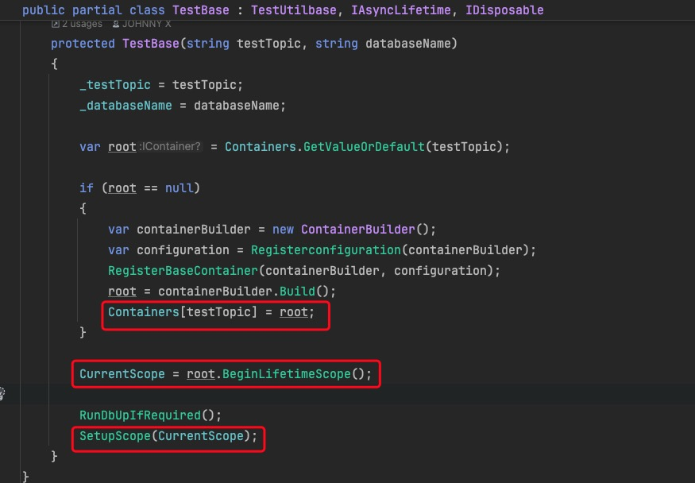
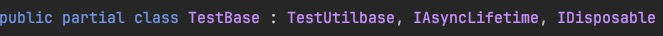
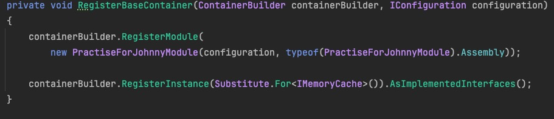
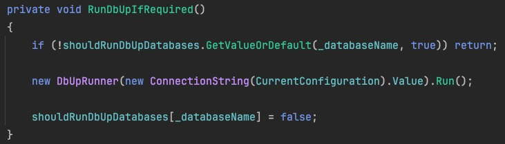

### coverlet.collector包

`coverlet.collector` 是一个用于收集代码覆盖率信息的命令行工具。它的作用是帮助开发人员和测试人员收集和生成代码的覆盖率报告，以便评估测试的质量和覆盖的程度。

```
<PackageReference Include="coverlet.collector" Version="3.1.2">
​        <PrivateAssets>all</PrivateAssets>
​        <IncludeAssets>runtime; build; native; contentfiles; analyzers; buildtransitive</IncludeAssets>
​      </PackageReference>
```

`<PrivateAssets>all</PrivateAssets>`:

- `PrivateAssets` 元素定义了依赖项在传递时是否应该被排除。
- `all` 表示在传递依赖时，不应包括 `coverlet.collector` 包的任何内容。

`<IncludeAssets>runtime; build; native; contentfiles; analyzers; buildtransitive</IncludeAssets>`:

- `IncludeAssets` 元素定义了哪些资产（assets）应包括在项目中。

- ```
  runtime; build; native; contentfiles; analyzers; buildtransitive
  ```

  - `runtime`: 包含运行时相关的资产。
  - `build`: 包含构建时需要的资产。
  - `native`: 包含与本机代码相关的资产。
  - `contentfiles`: 包含任何内容文件。
  - `analyzers`: 包含分析器相关的资产。
  - `buildtransitive`: 包含所有构建相关的传递性资产。

这样的配置告诉项目系统如何处理 `coverlet.collector` 包的依赖关系和资产，确保在构建和运行时正确包含和排除必要的组件和文件。


### Microsoft.NET.Test.Sdk包

主要用于.NET平台的单元测试和集成测试。

允许在开发过程中运行和管理单元测试和集成测试。

可以识别和执行测试项目中的测试方法，包括使用一些流行的测试框架（如 xUnit、NUnit、MSTest 等）编写的测试。


### NSubstitute包

NSubstitute 是一个用于 .NET 平台的开源库，用于创建和管理 .NET 应用程序中的测试替代品（mocks、stubs 和 fakes）。

可以使用 NSubstitute 设置测试替代品的期望行为，包括定义方法的返回值、抛出异常或模拟方法的执行。同时，你还可以断言测试替代品是否按照预期进行了调用。允许创建递归的测试替代品。


NSubstitute 通过拓展方法直接定义mock对象调用方法的返回值，传入mock方法的对象类型要使用Arg.any\<T>


### Shouldly包

Shouldly 是一个.NET 平台上的开源断言库，用于编写更加清晰和表达力强的单元测试。


### 集成测试项目配置

```
<ItemGroup>  
<Content Update="appsettings.json">    
<ExcludeFromSingleFile>true</ExcludeFromSingleFile>    <CopyToOutputDirectory>PreserveNewest</CopyToOutputDirectory>    <CopyToPublishDirectory>PreserveNewest</CopyToPublishDirectory>  
</Content> 
</ItemGroup>
```

**ExcludeFromSingleFile**: `<ExcludeFromSingleFile>true</ExcludeFromSingleFile>` 指定是否将此内容项排除在单文件发布（single file publish）之外。单文件发布是.NET 5及更高版本中引入的功能，允许将应用程序及其依赖项打包为单个可执行文件。

**CopyToOutputDirectory**: `<CopyToOutputDirectory>PreserveNewest</CopyToOutputDirectory>` 指定将 `appsettings.json` 文件复制到输出目录时的行为。`PreserveNewest` 表示只有当文件比输出目录中的文件更新时，才会复制该文件。

**CopyToPublishDirectory**: `<CopyToPublishDirectory>PreserveNewest</CopyToPublishDirectory>` 类似于 `CopyToOutputDirectory`，但是用于发布目录。指定了在发布时将 `appsettings.json` 复制到发布目录时的行为，这里也是 `PreserveNewest`，即保留更新的文件。


#### 创建TestUtilBase基类，TestUtil类继承基类

功能：

TestUtil的ReadJsonFileFromResource方法可以读取本地文件配置

可以调用TestUtilBase的SetupScope方法，设置Autofac容器的作用域


TestUtilBase类

TestUtilBase的SetupScope方法，用于设置Autofac容器的作用域。可以被TestUtil和TestBase调用该方法用于设置当前容器上下文




TestUtilBase还提供了一系列RunXxx的泛型方法，泛型指定类要获取的服务类型

方法创建子容器，获取了服务实例并执行相应的操作

例子：

```
protected async Task Run<T>(Func<T, Task> action, Action<ContainerBuilder> extraRegistration = null)
{
    var dependency = extraRegistration != null
        ? _scope.BeginLifetimeScope(extraRegistration).Resolve<T>()
        : _scope.BeginLifetimeScope().Resolve<T>();
    await action(dependency);
}
```

```
await Run<IRepository>(async repository =>
{
    var beforeCreateFood = await repository.CountAsync<Foods>(x => true).ConfigureAwait(false);

    beforeCreateFood.ShouldBe(0);

    await _foodsUtil.CreateFoodAsync(food);

    var afterUpdateFood = await repository.FirstOrDefaultAsync<Foods>(i => i.Name.Equals("mike")).ConfigureAwait(false);
    
    afterUpdateFood?.Color.ShouldBe("white");
    afterUpdateFood?.Name.ShouldBe("mike");
});
```

传入了lambda格式的委托，获取IRepository的服务实例，并执行相应的数据库操作和断言来完成测试。


#### 创建基类XxxBase类用于XxxFixture类继承使用

创建TestBase partial类继承TestUtilbase类实现IAsyncLifetime、IDisposable接口，



创建另一个TestBase.Initial partial类，用于实现TestBase调用的方法（跟初始化、后置处理有关）


TestBase类


构造函数根据传入的参数初始化testTopic和databaseName两个属性

尝试根据testTopic从类中的静态成员变量Containers集合中取到autofac容器

如果根据传入的testTopic取不到容器，

则先调用在TestBase.Initial定义的Registerconfiguration方法，传入autofac的ContainerBuilder参数


该方法读取类路径下的`_testTopic`属性值后缀的appsetting配置文件，构建configuration并注册获取实例返回


然后再调用在TestBase.Initial定义的RegisterBaseContainer方法，

传入containerBuilder和拿到的configuration实例



该方法先注册了autofac的module，再注册了NSubstitute创建的代理对象


回到调用出，再通过containerBuilder.Build()构建出autofac容器，存入Containers静态集合中

```
root = containerBuilder.Build();
Containers[testTopic] = root;
```


通过容器创建子容器并赋值给属性中的集合

```
CurrentScope = root.BeginLifetimeScope();

RunDbUpIfRequired();
SetupScope(CurrentScope);
```


RunDbUpIfRequired()则是在TestBase.Initial定义的用于执行DbUp脚本的方法



shouldRunDbUpDatabases静态集合根据传入的_databaseName获取布尔类型值，

如果有该_databaseName，则返回对应的布尔值，执行过脚本为false，该行直接返回，不启动DbUp

没有该_databaseName则返回指定的默认值true，该行继续执行，

传入configuration服务创建ConnectionString对象，启动DbUp，并标记该数据库脚本已执行


除此之外因为TestBase还继承了IAsyncLifetime、IDisposable接口

`IAsyncLifetime` 接口定义了两个异步方法：`InitializeAsync()` 和 `DisposeAsync()`。

`InitializeAsync()` 方法用于在对象实例化之后立即执行异步初始化操作。

`DisposeAsync()` 方法则在对象销毁之前执行异步清理操作。

`IDisposable`接口定义了一个方法 `Dispose()`，使用`using` 语句来自动调用实现了 `IDisposable` 接口的对象的 `Dispose()` 方法。


TestBase.Initial的实现

```
public Task DisposeAsync()
{
    return Task.CompletedTask;
}
```

```
public void Dispose()
{
    ClearDatabaseRecord();
}
```


清理数据库ClearDatabaseRecord()方法实现：


先从当前的configuration服务取到ConnectionString创建数据库连接

在名为_databaseName的数据库中查询所有表名

根据_tableRecordsDeletionExcludeList这个集合排除不需要执行清理的数据库

使用deleteStatements字符串集合拼接sql字符串

最后拼接完成后执行


#### 创建XxxFixtureBase类，继承TestBase类

```
[Collection("food Tests")]
public class FoodFixtureBase : TestBase
{
    protected FoodFixtureBase() : base("_food_", "Test")
    {
    }
}
```

[Collection("food Tests")]用于组织和分组测试类，以便更好地管理和执行单元测试。

调用了父类的构造方法指定了_testTopic和 _databaseName


创建XxxUtil类继承TestUtil类

调用父类构造函数传入当前的容器上下文

创建一系列用于测试类的方法例如

```
public async Task<CreateFoodResponse> CreateFoodAsync(CreateFoodDto food)
{
    return await RunWithUnitOfWork<IMediator, CreateFoodResponse>(async mediator =>
    {
        var response = await mediator.SendAsync<CreateFoodCommand, CreateFoodResponse>(
            new CreateFoodCommand { Food = food }); 
        
        return response;
    });
}
```


创建XxxFixture、XxxFixture.Review、XxxFixture.Exception三个partial类，继承XxxFixtureBase类

XxxFixture类：

```
private readonly FoodsUtil _foodsUtil;

public FoodFixture()
{
    _foodsUtil = new FoodsUtil(CurrentScope);
}
```

构造函数创建Fixture类对应的Util类


XxxFixture.Review和XxxFixture.Exception则是两个针对性不同的测试类


### 1、共享上下文

```
[Collection("food Tests")]
public class FoodFixtureBase : TestBase
{
    protected FoodFixtureBase() : base("_food_", "Test")
    {
    }
}
```

[Collection("")]标记在Fixturebase类上，代表集成该base类的Fixture属于一个测试集合，

共享上下文（调用TestBase的构造方法初始化了相关的上下文）

其中FoodFixture的一个partial类，又继承了FoodFixtureBase类，

并在其他两个FoodFixture共享FoodsUtil的使用

```
public partial class FoodFixture : FoodFixtureBase
{
    private readonly FoodsUtil _foodsUtil;

    public FoodFixture()
    {
        _foodsUtil = new FoodsUtil(CurrentScope);
    }
}
```


### 2、UnitOfWork测试

使用UnitOfWork时

不应该在XxxDataProvider类的方法调用_unitOfWork.SaveChangesAsync()，

可能会导致异常发生前提交了事务

应该使用_unitOfWork.ShouldSaveChanges = true;

在UnifyOfWorkSpacification中的AfterExecute方法统一判断是否要提交事务

OnException方法捕获到异常后AfterExecute方法不会执行，可以保证发生异常后回滚事务


### 3、编写测试用例

编写XxxUtil类继承TestUtil类

```
public FoodsUtil(ILifetimeScope scope) : base(scope)
{
}
```

构造函数调用TestUtil类方法拿到上下文

类内编写方法，像CommandHandler、RequestHandler中一样使用mediator发送请求

```
public async Task<CreateFoodResponse> CreateFoodAsync(CreateFoodDto food)
{
    return await RunWithUnitOfWork<IMediator, CreateFoodResponse>(async mediator =>
    {
        var response = await mediator.SendAsync<CreateFoodCommand, CreateFoodResponse>(
            new CreateFoodCommand { Food = food }); 
        
        return response;
    });
}
```

编写XxxFixtureBase类

```
[Collection("Food Tests")]
public class FoodFixtureBase : TestBase
{
    protected FoodFixtureBase() : base("_food_", "Tests")
    {
    }
}
```

指定了_testTopic和 _databaseName


编写FoodFixture类继承FoodFixtureBase

初始化

```
public partial class FoodFixture : FoodFixtureBase
{
    private readonly FoodsUtil _foodsUtil;

    public FoodFixture()
    {
        _foodsUtil = new FoodsUtil(CurrentScope);
    }
}
```


编写测试用例调用XxxUtil里的方法

```
public partial class FoodFixture
{
    [Fact]
    public async Task CanCreateFood()
    {
        var food = new CreateFoodDto { Name = "mike", Color = "white" };

        await Run<IRepository>(async repository =>
        {
            var beforeCreateFood = await repository.CountAsync<Foods>(x => true).ConfigureAwait(false);

            beforeCreateFood.ShouldBe(0);

            await _foodsUtil.CreateFoodAsync(food);

            var afterUpdateFood = await repository.FirstOrDefaultAsync<Foods>(i => i.Name.Equals("mike")).ConfigureAwait(false);
            
            afterUpdateFood?.Color.ShouldBe("white");
            afterUpdateFood?.Name.ShouldBe("mike");
        });
    }
}
```

使用断言工具测试结果是否符合预期


#### xunit数据提供器

[InlineData]、[MemberData] 和 [ClassData]分别从属性、类中的方法、类获取数据
