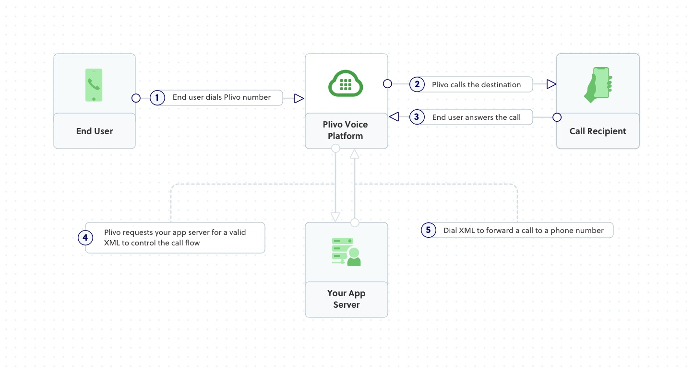
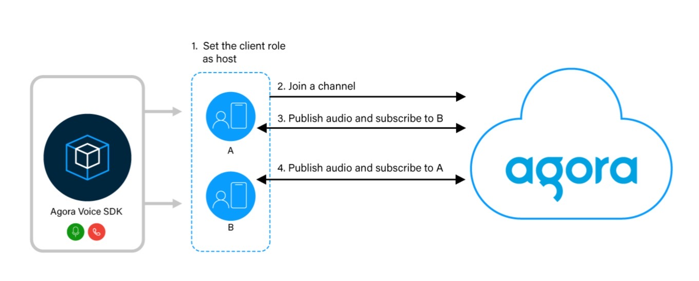

#### IP语音传输 VoIP 概念

[隐私号码原理](https://baike.baidu.com/item/%E9%9A%90%E7%A7%81%E5%8F%B7/59458960?fr=ge_ala)

[VoIP百度百科](https://baike.baidu.com/item/VoIP/110300)

[VoIP和SIP](https://blog.csdn.net/qawsedrf123lala/article/details/119938154)

[asterisk、pbx等基本概念](https://blog.csdn.net/liuxiao723846/article/details/79582973)

PSTN ( Public Switched Telephone Network )公共交换电话网络，即我们日常生活中常用的电话网

传统的PBX利用[电路交换](https://baike.baidu.com/item/电路交换/2472932?fromModule=lemma_inlink)的原理来实现[集团电话](https://baike.baidu.com/item/集团电话/7445249?fromModule=lemma_inlink)的功能，而IP PBX则使用[TCP/IP协议](https://baike.baidu.com/item/TCP%2FIP协议/212915?fromModule=lemma_inlink)，利用包交换的原理，在[以太网](https://baike.baidu.com/item/以太网/99684?fromModule=lemma_inlink)上实现了相同的功能。

Asterisk：开源的IP PBX应用

SIP服务器是[IP PBX](https://baike.baidu.com/item/IP PBX/8639082?fromModule=lemma_inlink)的主要组件，负责建立网络中所有的SIP电话通话。

实现虚拟号码方案：

1、购买SIP提供商提供的号码和转接服务（可能需要身份认证，号码费用较高）

2、不使用虚拟号码直接进行网络语音通信(VoIP) 如使用Twilio的api等 （成本低）

3、自己搭建IP PBX交换机服务器（asterisk），连接SIP提供商服务器获取已购买的虚拟号码如Twilio等 (比较复杂，费用可能相较第一种低一些)

[号码的类型:Local、Mobile、Toll free](https://www.nxcloud.com/news/408.html)

#### SIP提供商定义

SIP提供商是一种服务提供商，允许用户通过互联网使用SIP（会话发起协议）进行语音和视频通话。SIP提供商通常提供以下服务：

### 服务内容

1. **SIP中继（SIP Trunking）**
   - 通过互联网连接PSTN（公用电话交换网），允许企业通过现有的IP PBX系统进行外部电话呼叫，而不需要传统的电话线。
2. **VoIP电话服务**
   - 提供IP电话服务，使用户可以使用软电话、硬电话或其他SIP设备进行呼叫。
3. **虚拟电话号码**
   - 提供本地或国际虚拟电话号码，使用户可以在不同国家或地区接收电话。
4. **短信服务**
   - 通过SIP协议或API接口发送和接收短信。
5. **视频通话**
   - 提供视频通信服务，通过SIP协议实现高质量的视频通话。

#### [plivo](https://www.plivo.com/use-case/call-forwarding-service/)

可以通过租用号码实现中间号转接

[官方文档](https://www.plivo.com/docs/voice/use-cases/call-forwarding/node)

#### agora等语音通信sdk

只能实现网络语音通信

#### 