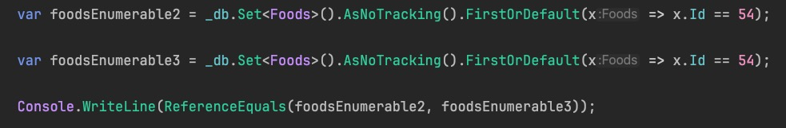

#### 1、在使用了autofac下，配置EFCore连接Mysql

（1）导nuget包

Microsoft.EntityFrameworkCore

Pomelo.EntityFrameworkCore.MySql

（2）配置appsettings.json并为依赖注入读取做准备

在appsettings.json中配置mysql连接

可以去https://www.connectionstrings.com/ 查看对应版本的模版

创建IConfigurationSetting接口，有一个可以指定泛型属性的子接口

```
public interface IConfigurationSetting
{
}

public interface IConfigurationSetting<TValue> : IConfigurationSetting
{
    TValue Value { get; set; }
}
```

创建一个ConnectionString类，用于从appsetting中读取ConnectionStrings

```
public class ConnectionString : IConfigurationSetting<string>
{
    public string Value { get; set; }
    
    public ConnectionString(IConfiguration configuration)
    {
        Value = configuration.GetConnectionString("Default");
    }
}
```

（3）创建实体类

创建IEntity基类，提供有Id属性的泛型子接口

创建测试实体类继承基类，通过特性指定Id为数据库自增主键，指定表名


（4）DbContext配置数据库连接和实体类

编写自己的Context类继承EF提供的DbContext

构造函数注入ConnectionString配置类

重写OnConfiguring方法配置数据库连接信息

`optionsBuilder.UseMySql(_connectionString.Value,new MySqlServerVersion(new Version(8,4,0)));`

重写OnModelCreating方法

```
protected override void OnModelCreating(ModelBuilder modelBuilder)
{
    typeof(PractiseForKennyDbContext).GetTypeInfo().Assembly.GetTypes()
        .Where(t => typeof(IEntity).IsAssignableFrom(t) && t.IsClass).ToList()
        .ForEach(x =>
        {
            if (modelBuilder.Model.FindEntityType(x) == null)
                modelBuilder.Model.AddEntityType(x);
        });
}
```

把PractiseForKennyDbContext所在程序集的中实现了 `IEntity` 接口的所有类，作为数据库模型的实体类型添加到 `modelBuilder` 中


（5）在autofac的module类注册ConnectionString类和自己编写的DbContext类

```
private void RegisterDbContext(ContainerBuilder builder)
{
    builder.RegisterType<PractiseForKennyDbContext>()
        .AsSelf()
        .As<DbContext>()
        .AsImplementedInterfaces()
        .InstancePerLifetimeScope();
}

private void RegisterSettings(ContainerBuilder builder)
{
    var settingTypes = typeof(PractiseForKennyDbContext).Assembly.GetTypes()
        .Where(t => t.IsClass && typeof(IConfigurationSetting).IsAssignableFrom(t))
        .ToArray();

    builder.RegisterTypes(settingTypes).AsSelf().SingleInstance();
}
```


（6）编写控制器和实现类

在实现类注入自己编写的DbContext类

在方法中通过注入的DbContext类获取dbset类

```
var dbset = _practiseForKennyDbContext.Set<Foods>();
```

再调用对应api进行数据库操作


#### EFCore实体跟踪学习

跟踪是指EFCore将有关实体实例的信息保存到它的更改跟踪器中，跟踪的实体检测到的任何修改都会被saveChanges期间保存到数据库中。（只会跟踪有键的实体）

实体实例在以下情况下会被跟踪：

- 从针对数据库执行的查询返回
- 通过 `Add`、`Attach`、`Update` 或类似方法显示附加到 DbContext
- 检测为连接到现有跟踪实体的新实体

每次查询该实体根据主键值决定是否创建一个新的实例

多次调用_dbContext.FindAsync查询同个实体类型，如果使用同一个主键，只要该实体没有修改，只会执行一次sql查询，DbContext保存一个实例

使用其他查询方法多次查询同个实体类型，每次都会执行sql查询，DbContext根据主键保存实例


被跟踪的实体被修改且调用saveChanges时，才能从数据库中查询到最新值

没有被修改，则查询该实体都是当前dbcontext中保存的对应主键的实例值，查询不到数据库的最新值


使用.AsNoTracking()不跟踪实体时，不会在DbContext中保存实体信息，每次从数据库中查询最新纪录，每次返回新实例



不跟踪将返回false，跟踪则返回true


#### 延迟加载问题

导航属性开启了延迟加载，如果在Dbcontext上下文中多次访问该导航属性（如foreach遍历），将发送多次Sql请求，导航属性不需要频繁访问时再开启延迟加载


#### 实体属性是否必填

插入数据库时，实体属性如果是值类型，则EFCore约定配置为必须属性，除非使用 ? (c# 8 新功能NRT)标记为可为空的属性则为可选属性

如果是引用类型，由于NRT的引入，插入数据库时必须指定值，所有引用类型都默认不可为空，如果需要指定为可选属性，则使用 ? 标记

把null赋值给引用类型会被编译器警告，在插入时会报错，除非使用 ？标记为可为空类型，才能在数据库中为该字段存储null值


还可以使用[Required]在模型绑定时指定必填属性


ADO.NET 和 Entity Framework Core (EF Core) 都是用于访问和操作数据库的技术，但它们在抽象层次和功能上有明显的区别。

### ADO.NET

#### 简介

ADO.NET 是 .NET 框架的一部分，是用于与关系数据库进行交互的基础数据访问技术。它提供了直接操作数据库的类和方法。

#### 特点

- **低级别的数据访问**：提供了访问数据库的底层方法，包括连接到数据库、执行命令、读取数据等。
- **高性能**：由于它是低级别的，开发者可以进行非常细粒度的控制，适合对性能有极高要求的场景。
- **数据提供者**：支持多种数据库，包括 SQL Server、Oracle、MySQL 等，每种数据库都有相应的数据提供者（`SqlClient`、`OracleClient`、`MySqlClient` 等）。
- **手动操作**：需要手动编写 SQL 语句，处理数据的 CRUD 操作。

#### 示例

```c#
using (MySqlConnection conn = new MySqlConnection("connectionString"))
{
    MySqlCommand cmd = new MySqlCommand("Select * from foods", conn);
    
    conn.Open();
    
    if (conn.State != ConnectionState.Open)
        return Ok();

    MySqlDataReader reader = cmd.ExecuteReader(CommandBehavior.CloseConnection);

    while (reader.Read()) //每次以串行方式读取一行纪录
    {
        //sqlDataReader.FieldCount：获取数据阅读器中一行纪录的列数，结果为一个int值
        for (int index = 0; index < reader.FieldCount; index++)
        {
            //sqlDataReader.GetName()获取指定列的名称
            //reader[index].ToString()提取列里面的数据的
            Console.WriteLine(reader.GetName(index) + ": " + reader[index].ToString() + ";");
        }
      
        Console.WriteLine();
    }

    reader.Close();
}

return Ok();
```


### Dapper

#### 特点

- **微型 ORM**：Dapper 是一个轻量级的 ORM（对象关系映射）工具。
- **手动编写 SQL**：仍然需要手动编写 SQL 语句，但 Dapper 简化了数据映射。
- **高性能**：Dapper 使用 ADO.NET 底层操作，性能接近于 ADO.NET，且在某些场景下可能更优。
- **简洁性**：减少了样板代码，自动处理数据映射，代码更简洁易读。


#### EFCore为实体的导航属性赋值时创建的实例类型

如果 EF 需要将实体添加到集合导航，则在执行查询时，它将初始化集合（如果当前为 `null`）。 创建的实例取决于导航的公开类型。

- 如果导航公开为 `HashSet<T>`，则会创建使用 [ReferenceEqualityComparer](https://learn.microsoft.com/zh-cn/dotnet/api/system.collections.generic.referenceequalitycomparer) 的 `HashSet<T>` 实例。
- 否则，如果导航公开为具有无参数构造函数的具体类型，则会创建该具体类型的实例。 这适用于 `List<T>`，但也适用于其他集合类型，包括自定义集合类型。
- 否则，如果导航公开为 `IEnumerable<T>`、`ICollection<T>` 或 `ISet<T>`，则会创建使用 `ReferenceEqualityComparer` 的 `HashSet<T>` 实例。
- 否则，如果导航公开为 `IList<T>`，则会创建 `List<T>` 实例。
- 否则会引发异常。


#### EFCore 7 批量修改批量删除新特性

https://learn.microsoft.com/zh-cn/ef/core/what-is-new/ef-core-7.0/whatsnew#executeupdate-and-executedelete-bulk-updates

不涉及到实体的跟踪，效率更高

只能对单个表执行操作

不能级联删除

无需调用saveChanges

- 必须显式指定要做出的特定更改；EF Core 不会自动检测到它们。
- 任何跟踪的实体都不会保持同步。


updateRange和removeRange则能根据集合实体的Id删除或更新

但是会根据每个实体id生成一条对应sql，

也可以使用EFCore.BulkExtensions第三方库 支持EFCore根据表达式树执行批量操作


实体跟踪会检测实体的变更，在调用saveChanges时自动生成对应的sql语句执行，而不需要显示的进行api调用。


#### 关于使用键集分页和偏移分页

https://learn.microsoft.com/zh-cn/ef/core/querying/pagination


#### 全局查询筛选器

可以在DBContext中的OnModelCreating方法中使用

modelBuilder.Entity(类型).HasQueryFilter(lambda表达式)

自动在某一实体类型的查询加上筛选条件


项目中的应用：

```c#
if (QueryFilterInterfaceTypes.Any( t => t.IsAssignableFrom(x)))
{
    modelBuilder.Entity(x)
        .HasQueryFilter(GenerateInterfaceQueryFilter(x));
}
```

扫描继承了基类IEntity的类型，再通过扫描继承了特定接口（QueryFilterInterfaceTypes）的类型，构造lambda表达式来配置筛选器

Any方法，遍历找到满足元素立即返回true

x：实体类型

QueryFilterInterfaceTypes：需要添加筛选器的接口类型

GenerateInterfaceQueryFilter：生成表达式树的方法

```c#
private LambdaExpression GenerateInterfaceQueryFilter(Type t)
{
    var parameterExpression = Expression.Parameter(t, "x"); //指定表达式参数的类型为t，名称为x
    var bodyExpressions = GenerateInterfaceQueryFilterBodyExpressions(parameterExpression, t); //构造表达式体
    var body = bodyExpressions.Aggregate(Expression.AndAlso); //将一个表达式树集合用 && 连接 内部调用MoveNext遍历bodyExpressions
    return Expression.Lambda(body, parameterExpression); //构造表达式树 x => x.IsDel == false
}

private IEnumerable<BinaryExpression> GenerateInterfaceQueryFilterBodyExpressions(
    ParameterExpression parameterExpression, Type t)
{
    if (typeof(ICanBeSoftDeleted).IsAssignableFrom(t))
    {
        yield return Expression.Equal(Expression.Constant(false), Expression.Property(parameterExpression,
            nameof(ICanBeSoftDeleted.IsDel))); //Expression.Property表示访问参数的某个对应名字的属性
      //Expression.Equal 用于生成等值表达式 Expression.Constant(false) 常量表达式
    }
  //其他接口类型省略，同样使用yield返回
}
```


#### DbContext配置拦截器

项目中在DBContext配置类的OnConfiguring方法调用AddInterceptors，将已注册的、继承了DbCommandInterceptor类的拦截器类添加到DBContext中，比如CheckSqlCommandInterceptor，需要在module注册Dbcontext前注册拦截器，再在DbContext注入

通过重写了DbCommandInterceptor中的ReaderExecutingAsync、DataReaderDisposing方法，控制Reader调用前、Reader释放时的逻辑，检查了查询sql有无使用子句筛选、log了返回数据过多，影响行数过多的查询。

可重写的方法：https://learn.microsoft.com/zh-cn/dotnet/api/microsoft.entityframeworkcore.diagnostics.dbcommandinterceptor?view=efcore-8.0

只能拦截EFcore的数据库操作，使用ADO.NET等其他方式调用数据库无法拦截


DataReaderDisposing中的DataReaderDisposingEventData参数

可以获取RecordsAffected纪录的影响条数，查询操作小于0

可以获取ReadCount，数据库读操作的次数


#### DbContext OnConfiguring额外信息配置

.EnableDetailedErrors()

用于启用详细错误信息。当这个选项被启用时，EF Core 在抛出异常时会提供更详细的错误信息。这对调试复杂查询或排查性能问题非常有用。

由于它会生成更详细的错误信息，因此可能会稍微影响性能，尤其是在生产环境中。通常建议只在开发和测试环境中启用。


.EnableSensitiveDataLogging()

用于启用敏感数据日志记录。当这个选项被启用时，EF Core 在日志中包含数据库操作的参数值和其他敏感信息。

由于它会记录所有敏感数据（如用户密码、个人信息等），存在潜在的安全风险。应谨慎使用，并且通常只在开发和测试环境中启用，避免在生产环境中启用。


### 时间问题

#### mysql datetime(3) 类型

在 MySQL 中，`datetime(3)` 是 `datetime` 数据类型的一种变体，它允许精确到毫秒级别的时间戳存储。

解释

- **`datetime`**: 默认情况下，MySQL 的 `datetime` 类型用于存储日期和时间，不包括时区信息。它的格式是 `YYYY-MM-DD HH:MM:SS`，即精确到秒。
- **`datetime(3)`**: 这里的 `(3)` 是一个精度参数，表示微秒部分的位数。具体来说：
  - `3` 表示精确到毫秒（千分之一秒），允许存储 3 位小数，即 `YYYY-MM-DD HH:MM:SS.fff`。


#### 前端传递的时间参数使用datetimeoffset

`DateTimeOffset` 的默认字符串表示形式包含日期、时间和时区偏移量。例如：

```
csharp
复制代码
DateTimeOffset now = DateTimeOffset.Now;
Console.WriteLine(now); // 输出类似 "2024-08-09T15:30:45+02:00"
```

在上述代码中：

- `2024-08-09` 是日期部分。
- `15:30:45` 是时间部分。当前时区
- `+02:00` 是相对于 UTC 的时区偏移量。


#### 时区偏移量

EF Core  把DateTimeOffset类型存储到Mysql中的Datetime类型中时会自动转换成UTC时区

比如：

应用：2024-08-09T08:22:36+02:00

数据库：2024-08-09 06:22:36


EF Core从数据库中读取datetime类型并转换成DateTimeOffset类型时，会把数据库的时间当成UTC时间

比如

数据库：2024-08-09 08:22:36

应用：2024-08-09T08:22:36+00:00


#### 批量查询大数据拓展

InitializeMultiLanguagesCache方法在查询大批量的entityLanguages实体集合时用到了ToListByLastModifiedDatePagingAsync()这个拓展方法分批查询

ToListByLastModifiedDatePagingAsync：

查询记录条数，小于2k条直接一次性查库

查出LastModifiedDate最小记录的日期

初始化集合容量，防止频繁扩容

```c#
var list = new List<TSource>((int)(dbTotalCount * 1.1m));
```


```c#
var cts = new CancellationTokenSource(TimeSpan.FromMinutes(20)); //超时自动取消
while (!cts.IsCancellationRequested)
{
    var batchInfo = await queryable.GetBatchCountInfo(minDate, stepDays, batchMaxCount, cancellationToken)
        .ConfigureAwait(false); //每stepDays天查询一次，累加记录条数，最大2000 * 3条，返回该批次查询的最小日期，最大日期，记录条数

    var tempList = await queryable
        .DataRangFilterToListAsync(batchInfo.MinDate, batchInfo.MaxDate, maxCount, batchInfo.FinalBatchCount,
            cancellationToken) //循环查记录，每次查maxCount（2000）条，直到查询完batchInfo.FinalBatchCount条
        .ConfigureAwait(false);
    list.AddRange(tempList);
    if (batchInfo.FinalBatchCount == 0 || !tempList.Any())
        break;

    minDate = batchInfo.MaxDate; //更新每轮循环的minDate
}

return list.Distinct().ToList();
```


