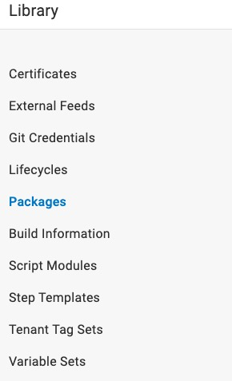

#### 学习octopus的使用


提前部署Octopus Server、制作发布应用镜像、


#### Infrastructure模块

在Deployment Targets中配置要部署package或者容器到什么地方，比如物理服务器、虚拟机、云服务中的实例或 Kubernetes 群集中的节点

##### 新建Deployment Targets

选择要部署目标的类型，支持windows、linux、Mac、azure、k8s等

其中部署到一些环境需要目标环境安装Octopus Tentacle，一个轻量级agent服务，用来跟octopus通信

Octopus Server 可以通过 SSH 与Linux、mac通信，不用安装Tentacle agent

Octopus Tentacle可以配置两种不同的通信方式与 Octopus Server进行连接：轮询模式和监听模式。

Machine policies是一组设置，可以应用于 Tentacle 和SSH endpoints 。它们可用于：

自定义health checks的间隔。

运行自定义health checks脚本。

忽略health checks期间不可用的Machine。

配置 Calamari 和 Tentacles 以及 SSH Targets 的更新方式。

使用Tentacle从通信错误中恢复。

自动删除机器。


可以给Deployment Targets添加不同的role，比如数据库服务器、Web 服务器、应用服务器等角色


指定Environments 如dev、test、uat、prd等环境


workers、worker pool

workers是一些部署在windows、linux、mac机器中的一些用于执行任务的计算节点

Octopus Deploy 将部署和运维任务分发给 Deployment Targets 和 Workers。一般来说，简单的部署任务（如文件复制、配置更改等）通常会直接在 Deployment Targets 上执行，因为这些任务可以在目标环境中快速完成。

对于复杂或耗时的任务（如安装软件、运行集成测试、执行长时间脚本等），Octopus Deploy 可以选择将这些任务分发给 Workers。Workers 可能会比 Deployment Targets 配置更高的计算资源或专用的环境，从而提高任务执行的效率和可靠性


#### Library模块



通过External Feeds可以从team city、docker registry、nuget、github等远程托管中获取到package

比如team city需要添加一个nuget feed并使用已授权的URL来作为octopus中的External feed

详见[team city生成nuget feed](https://www.jetbrains.com/help/teamcity/using-teamcity-as-nuget-feed.html#Enabling+NuGet+Feed)

或者在team city build step中直接通过url和apikey 索引构建输出的package来推送

从以上网站推送的package会被存储在octopus的服务器本地路径中

还可以推送到octopus的内置仓库

可以设置一些step templates（还可以查看哪些project引用了这个模版，进行版本控制）

和Variable Sets（可以指定使用变量的Scope 比如dev、test）

可以在Certificates 上传和关联数字证书到部署中

还可以在Lifecycles，定义project要经历哪些environments的部署和发布


##### 定义process

新建project

项目空间 -> 新建项目 ->选择Project Group -> 选择Lifecycle -> 保存


在process中添加Deployment steps，定义了如发送消息，初始化运行环境、将package部署到Deployment Targets中等一系列步骤，其中一部分操作不是由Deployment Targets执行的，而是由定义的worker执行


在定义step时，开启Configuration features 针对不同环境使用不同的配置文件

在Variables 设置引用变量

每个step都有Conditions可以设置


在worker中执行的step，可以使用docker镜像来执行这个step

在process添加step时，选择**Execution Location**为**Run on a worker**

在**Container Image** 选择**Run inside a container on a worker**然后选择一个container registry和对应镜像名


可以在第一步或最后一步step添加approval


Deploying releases

在releases中选择对应的environment进行deploy，支持延时部署


#### 学习部署流程

在项目空间创建项目，选择对应的lifecycle

在process中添加step，选择deploy kebernetes containers的模版

使用default worker pool

选择tag 为 aws-eks的Target roles

选择step执行运行在worker上，还是在worker中的容器里，直接在worker上运行

配置deployment

Replicas：创建的pod的数量 1

Deployment Strategy：

**Rolling update deployments** deploys new pods while remove older pods

此选项要求两个容器版本可以并行运行，并避免停机

Kubernetes Object Status Check：

**Check that the rollout was successful**

使用 kubectl rollout status 命令来确认 Pod 已更新。


#### 继续学习容器部署流程

create deployment process 选择k8s容器这一步的 Add Container步骤：

指定使用的仓库和镜像id

配置容器暴露的端口

CPU Requests and Limits 一般正式项目要配置，使用占位符

可以添加一个config map用于为容器配置环境变量，configurations-webapi-#{Octopus.Deployment.Id | ToLower}

[conigMap octopus 文档](https://octopus.com/docs/deployments/kubernetes/deploy-container#configmap)

[conigMap K8s文档](https://kubernetes.io/zh-cn/docs/tasks/configure-pod-container/configure-pod-configmap/)


返回到添加k8s容器的配置：

设置k8s的namespace，#{K8SNameSpace}

配置这个部署的Service Name，Service Ports

添加一个Config Map用于应用的配置，可以实现动态配置，读取左侧Variables菜单项中的配置（包括了project的变量）


添加下一个process的step，deploy ingress：

在 Kubernetes 中，Ingress 是一种管理集群外部访问到服务（Service）的方法，通常通过 HTTP 和 HTTPS。Ingress 可以提供负载均衡、SSL 终止和基于名称的虚拟托管等功能。部署 Ingress 的目的是为应用程序配置一个可以在外部访问的入口点，从而使用户能够通过域名或 URL 访问内部服务。


设置Ingress Annotations

Ingress 经常使用注解（Annotations）来配置一些选项，具体取决于 Ingress 控制器

[Ingress Annotations octopus文档](https://octopus.com/docs/deployments/kubernetes/deploy-container#ingress-annotations)

[Ingress 控制器 k8s文档](https://kubernetes.io/zh-cn/docs/concepts/services-networking/ingress-controllers/)


设置Ingress host rules

匹配host名和请求的路径和端口来路由到对应的service


设置Ingress TLS


设置k8s的namespace，#{K8SNamespace}


配置IngressBaseDomainName


#### 访问集群

octopus发布成功后，由于服务类型选择的是ClusterIP类型，需要到k8s集群里访问服务

安装openlens k8sGUI工具

https://github.com/MuhammedKalkan/OpenLens/releases

获取对应集群的openlens config文件并配置


不能添加配置问题：

安装或更新至最新版本的 AWS CLI

AWS 命令行界面（AWS CLI）是**Amazon Web Services（AWS）推出的开源工具**。 可以通过命令行Shell 中的命令，使用CLI 与AWS 服务进行交互。

这里要访问AWS cluster，所以要安装这个CLI

安装完成后，拿到内部的OpenLens安装教程pdf文件

里面有AWS的配置步骤，不配置不能认证成功


安装步骤解决还是认证失败，解决：

```
<             apiVersion: client.authentication.k8s.io/v1alpha1
---
>             apiVersion: client.authentication.k8s.io/v1beta1
```

修改配置中的以上字段


进入集群后，发现pod一直重启

尝试添加容器的资源参数，没有效果

本地构建镜像并推送到计算机安装的docker上，验证docker容器是否能正常启动

发现是数据库不能正常连接，原因是docker不能访问宿主机对应的数据库端口

而项目上数据库配置的地址是本机IP，k8s中公网也不能访问本机的内网IP


launchSetting只在项目本地使用，容器中启动的.net8程序默认暴露的端口是8080，dockerfile需要暴露8080


没有配置相关路由转发的情况下，直接访问.net程序暴露的端口会404，可以直接按路由请求接口


mysql连接字符串需要添加

```
SslMode=none;
```


使用以下命令查看pod日志，发现还是mysql连接问题，k8s连不上本机的mysql

kubectl logs \<pod-name> --namespace=\<namespace>


⚠️发布前如果配置有修改，记得去Variables中修改ConfigMap中对应的配置