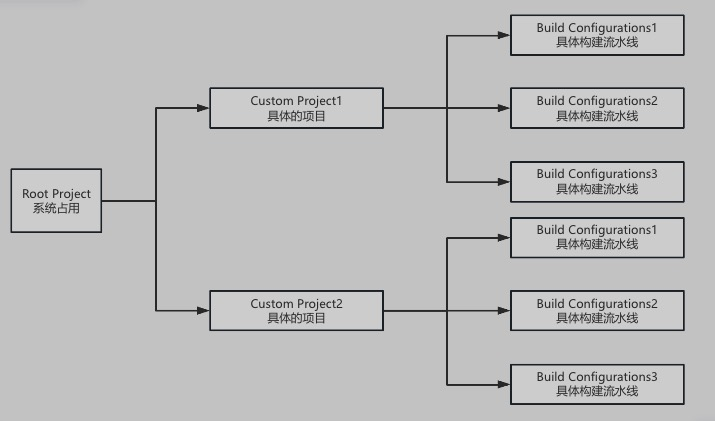
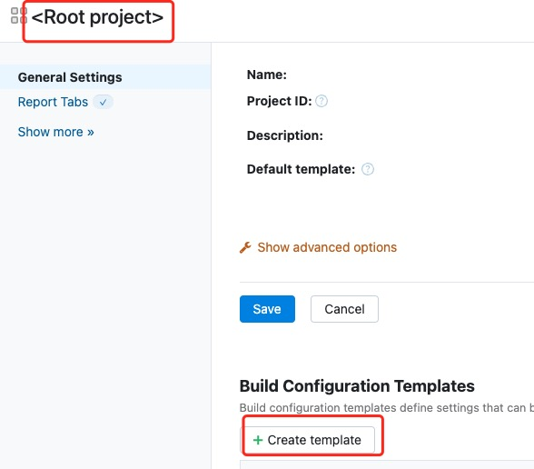
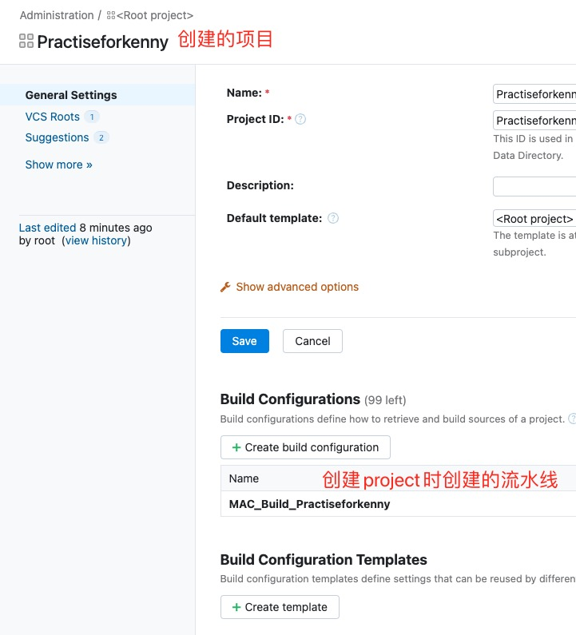
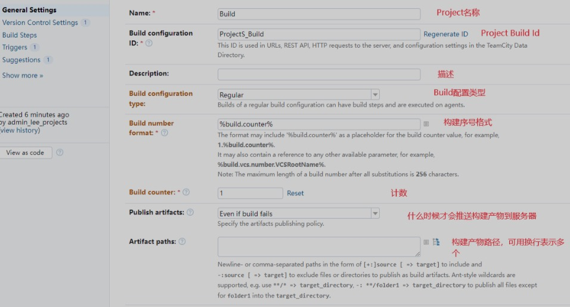
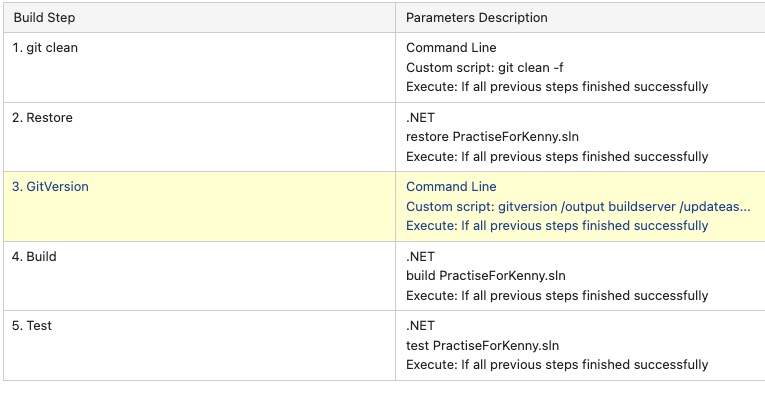
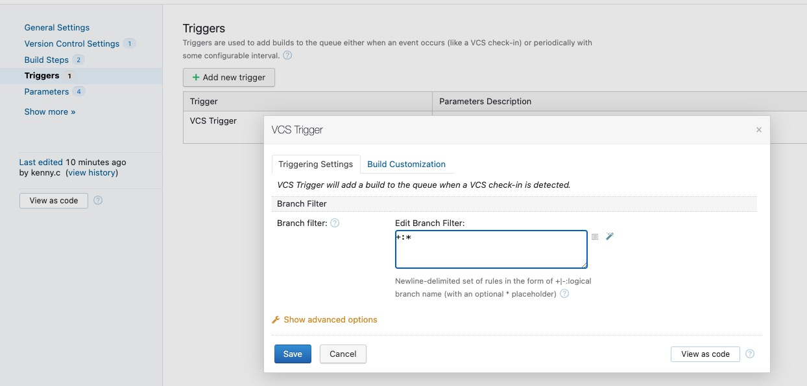
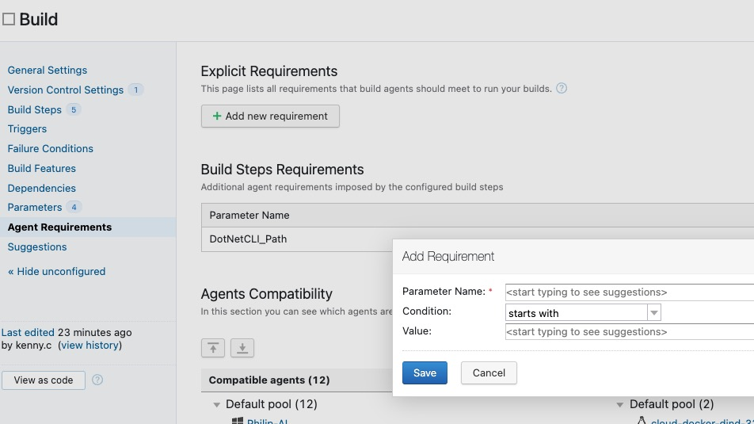
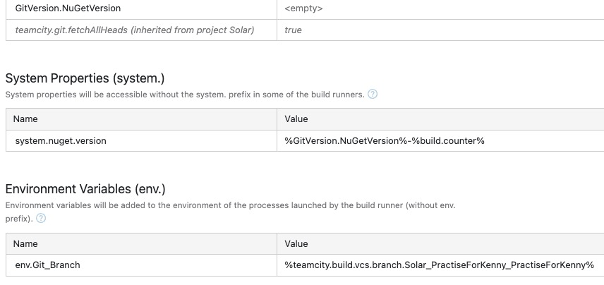
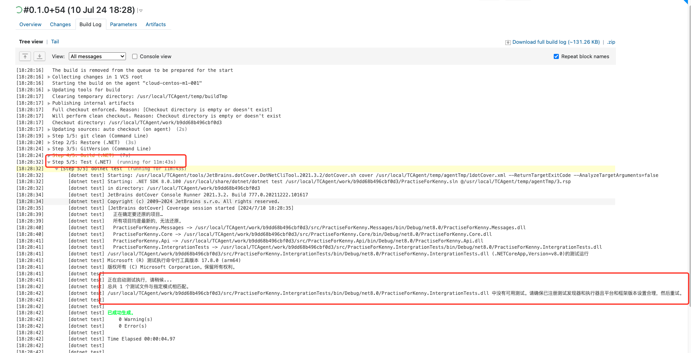

##### TeamCity

持续集成和持续交付系统，它由一个服务器（server）和多个代理（agent）组成。

要求JAVA8环境并配置环境变量，生产环境建议配置外部数据库存储用户数据和日志

TeamCity 服务器 (Server):

**中央协调和控制**: TeamCity 服务器是整个系统的核心，负责管理和协调构建过程以及整个持续集成和持续交付的工作流程。
**Web界面**: 提供用户界面，通过该界面用户可以配置构建任务、监控构建过程、查看报告和日志等。
**调度构建任务**: 根据配置的触发条件（例如代码提交、定时触发等），调度和触发构建过程。
**资源管理**: 管理构建过程中需要的资源，如构建工具、环境变量等。
**结果存储和报告**: 存储构建过程中生成的日志、报告和统计数据，并提供相关的查看和分析功能。

TeamCity 代理 (Agent):

**执行构建任务**: 代理负责实际执行服务器分配给它的构建任务。这些任务可以包括代码检查、编译、测试、打包等操作。
**本地资源管理**: 代理管理其运行在本地的资源，例如构建工具、第三方库、依赖项等。
**通信与反馈**: 与服务器进行通信，汇报构建任务的执行状态、日志输出以及任何报告结果。
**并行处理**: 多个代理可以并行处理多个构建任务，提高整体构建效率和吞吐量。

##### team city 结构



Root Project为TeamCity初始化时就创建的一个Project，是一个项目管理容器，可以配置一些全局设置


##### 创建通用构建流水线Template



通用模板Project里的配置可以在各个不同的Project的不同流水线中进行复用，从而便于管理，节约成本

也可以在每个具体的Project里创建模板，来进行差异化管理


##### 创建Project

第一次在root project下Create subproject

填入项目地址，创建工程，如果目标工程是私有的，需要配置相应的鉴权信息


##### 配置project

之前在root project创建的通用template会被创建的新project默认继承


##### 配置构建流水线



点进去就可以配置



##### 创建流水线节点

build step -> add build step



1、清理未被git追踪的文件 2、下载更新nuget依赖 3、根据本地git仓库生成项目版本号 4、构建项目 5、覆盖测试

还可以根据需要进行pack生成nuget包，然后octo push推送到octopus进行部署或者nuget push到nuget上


设置触发器



匹配符合命名的分支触发构建，+:* 表示任何分支

这里使用的是个人的考核项目，应该设置成+:\<default> 只触发默认分支


`gitversion /output buildserver /updateassemblyinfo true` 的作用是自动化地根据 Git 仓库信息生成项目版本号，并将其输出为构建服务器可以解析的格式，同时更新项目的 AssemblyInfo 文件中的版本信息。


##### 指定执行构建的agent



如果不指定 Agent Requirements，则构建将会被分配给任何可用的Agent


##### 容器化构建

可以构建另一条流水线用于项目的容器化

通常包括登陆docker，docker build制作镜像，docker push镜像到docker镜像仓库，docker remove清除agent中的镜像


##### 构建.net项目常用命令

**Build**:

- **含义**: 编译源代码并生成可执行的二进制文件（如 `.dll` 或 `.exe`）的过程。
- **在 .NET 中的使用**: 使用 MSBuild 或 Visual Studio 的构建功能将项目文件（如 `.csproj`）中定义的代码编译成可执行文件。

**Clean**:

- **含义**: 清理项目，删除生成的中间文件和输出文件，以确保从干净的状态开始构建。
- **在 .NET 中的使用**: 使用 MSBuild 或通过命令行执行 `dotnet clean` 命令来清理项目，删除之前构建生成的文件。

**Restore**:

- **含义**: 恢复项目依赖项，包括下载和安装项目所需的 NuGet 包或其他依赖项。
- **在 .NET 中的使用**: 使用 `dotnet restore` 命令来从 NuGet 存储库下载并安装项目所需的依赖项。

**Pack**:

- **含义**: 将项目打包成可发布的 NuGet 包，包括将项目编译后的程序集和相关的元数据打包成一个可以在 NuGet 网站上发布的单个文件。
- **在 .NET 中的使用**: 使用 `dotnet pack` 命令来执行打包操作，生成 NuGet 包。

**Publish**:

- **含义**: 将 .NET 应用程序部署到目标环境，包括生成和配置必要的文件以便在指定的环境中运行应用程序。
- **在 .NET 中的使用**: 使用 `dotnet publish` 命令来发布应用程序，生成可以部署到生产环境的文件和配置。

**Run**:

- **含义**: 运行 .NET 应用程序，启动应用程序以在本地开发环境或测试环境中执行。
- **在 .NET 中的使用**: 使用 `dotnet run` 命令来启动应用程序，通常用于在开发过程中快速测试和调试应用程序。

**Test**:

- **含义**: 执行单元测试和集成测试，验证代码的功能和质量。
- **在 .NET 中的使用**: 使用测试框架（如 NUnit、xUnit 等）编写和运行单元测试，确保代码按预期工作。


设置 Artifact paths 为 `**/output/*.nupkg` 的意思是，将从任意子目录中名为 `output` 的目录中找到并收集所有 `.nupkg` 文件作为构建的 Artifact。 （在agent中的目录）




添加一些参数


build前，要选择应用对应环境的agent进行构建


出现问题：build进行要test这一步时卡住




出现问题：测试用例同时执行断言异常，单独执行通过

这是因为在一个Fixture中的不同partial类虽然编写了两个[Fact]方法，但是在Fixture类被回收时才会调用dispose方法去执行里面清理数据库的代码，所以同一个Fixture中不同[Fact]用例对数据库是互相影响的，而且不同[Fact]方法是并行的会对断言结果造成不确定影响


update

测试类全部运行失败的原因：

TestBase根据\_testTopic获取autofac容器，如果没有则根据\_testTopic创建，并拿到容器开启一个LifeTimeScope

TestBase.Initial.cs类中的Registerconfiguration方法根据\_testTopic和_databaseName创建对应的application.json，并创建对应的数据库

```EnsureDatabase.For.MySqlDatabase(_connectionString);``` 确保数据库存在，不存在则创建

不是同个fixture中的fact影响，而是其他fixture中的fact方法影响，因为这里不同fixturebase类调用TestBase构造方法时传入了同一个数据库名，而testbase中的dispose方法是按数据库名识别然后遍历所有表进行清理的

总结：不同的fixture不要使用同一个数据库


出现问题：测试用例同时执行断言异常，单独执行通过

这是因为在一个Fixture中的不同partial类虽然编写了两个[Fact]方法，但是在Fixture类被回收时才会调用dispose方法去执行里面清理数据库的代码，所以同一个Fixture中不同[Fact]用例对数据库是互相影响的，而且不同[Fact]方法是并行的会对断言结果造成不确定影响


update

测试类全部运行失败的原因：

TestBase根据\_testTopic获取autofac容器，如果没有则根据\_testTopic创建，并拿到容器开启一个LifeTimeScope

TestBase.Initial.cs类中的Registerconfiguration方法根据\_testTopic和_databaseName创建对应的application.json，并创建对应的数据库

```EnsureDatabase.For.MySqlDatabase(_connectionString);``` 确保数据库存在，不存在则创建

不是同个fixture中的fact影响，而是其他fixture中的fact方法影响，因为这里不同fixturebase类调用TestBase构造方法时传入了同一个数据库名，而testbase中的dispose方法是按数据库名识别然后遍历所有表进行清理的

总结：不同的fixture不要使用同一个数据库


#### 解决dotnet8 在team city使用dotCover hanging问题

solar 组下的project 没有配置以下env参数值为1：

env.COMPlus_EnableDiagnostics

env.COMPlus_EnableDiagnostics_Profiler

env.DOTNET_EnableDiagnostics

env.DOTNET_EnableDiagnostics_Profiler

用于临时环境启用.net程序的诊断和性能分析工具


xunit.runner.visualstudio对于team city 构建test使用dotCover是必须的，否则不能检测到xunit的测试用例


team city 使用dotCover hanging时 view thread tump可以看到：

dotCover.exe cover C:\BuildAgent\temp\agentTmp\1dotCover.xml /ReturnTargetExitCode /AnalyzeTargetArguments=false

JetBrains.Profiler.PdbServer.exe --xxxx --stop_request_event=xxxx

hanging的原因是JetBrains.Profiler.PdbServer.exe这个由dotCover.exe派生的子线程一直没有结束

使用windows系统的agent后解决了hanging的问题，并成功生成覆盖测试报告