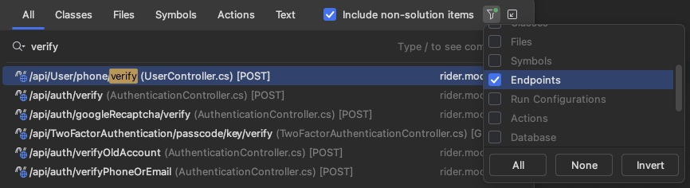

⚠️`ToArray()`和`ToList()`方法返回的数组和列表是浅拷贝，而不是深拷贝。

大量操作，用linq会可能会产生性能问题


using不加大括号作用域扩大，在写入文件时可能会造成资源占用


成员变量默认是private的，类默认是internal的


安装MySql踩坑

8.4.0 使用MacOs 安装时，会出现服务器启动失败一直重试

打开mysql偏好设置取消勾选 Keyring Data File


快速增强接口


#### 方法调用优先级

```
interface IInterface
{
    void Method();
}

class BaseClass
{
    public void Method()
    {
        Console.WriteLine("BaseClass.Method() called");
    }
}

class DerivedClass : BaseClass, IInterface
{
    // DerivedClass 继承了 BaseClass 并实现了 IInterface，但没有显式实现 Method 方法
}

DerivedClass obj = new DerivedClass();
obj.Method();  // 输出: BaseClass.Method() called
```

当一个类继承了另一个类和一个接口，并且继承的类中有与接口中同名的方法，但没有显式实现接口中的方法时，直接调用该方法会调用继承类中的方法。

这种行为符合面向对象编程中的方法调用优先级规则，即类中定义的方法优先于接口中的默认实现。


#### 中文乱码

忘记设置数据库字符集导致DbUp插入脚本中文乱码，修改后仍乱码

在ConnectionString后添加Charset=utf8mb4，脚本插入中文正常


dbContext.Update()如果传入实体主键为类型的默认值，会执行插入操作

addOrUpdate的逻辑时，记得把id映射到待修改的实体上


编写测试用例时RunWithUnitOfWork方法调用结束后才会调用saveChanges，可以分开几次调用


rider在尝试fetch时需要登陆公司gitlab，但是使用了rider内置插件后强制要求使用token，由于是私有仓库，不能使用token登陆，可以先禁用gitlab插件，在使用账号密码登陆，要使用插件再打开，不影响登陆状态


双击shift搜索定位controller方法 （也可以筛选endpoint）




⚠️在 C# 中，当一个 lambda 表达式作为委托传递给方法时，委托的参数来自于方法内部对该委托的调用。也就是说，委托的参数是在方法中调用该委托时传递的。


JWT token过期时间要用DateTime.UtcNow，避免分布式系统存储的时区问题


#### Rider ide快捷键生成构造函数的坑

由于声明的属性是private的，生成时首选自动检测访问权限，默认生成的构造函数是protected，导致autofac找不到构造函数


#### 异常：不能重复跟踪相同主键的实体

出现此异常的原因是执行了查询操作跟踪了一些实体

但是后来执行更新操作了时，又对之前查询跟踪的实体进行更新（相同主键）

而且是new 出来的实体，没有直接用查询返回的实体进行更新，导致出现不能重复跟踪相同主键实体的异常

EFCore根据主键值跟踪创建实例


#### 文件名规范

文件名不要使用mac等其他系统可以使用，但是windows系统不能使用的特殊字符
比如 : 和 "
否则windows系统从github上拉取文件会报错


#### 多线程中注意闭包问题

注意闭包捕获的作用域外的变量，是变量的引用值，而不是其值，比如：

```c#
var tasks = new List<Task>();

for (int i = 0; i < 10; i++)
{
    tasks.Add(Task.Run(() =>
    {
        // 使用闭包捕获循环变量i
        Console.WriteLine($"Task {i} is starting.");
      
        Task.Delay(1000).Wait();
      
        Console.WriteLine($"Task {i} is completed.");
    }));
}
```

这个例子中打印的 i 始终为循环结束后的 10

变量值发生改变时，闭包中捕获的变量也会改变，可以在作用域内创建一个新的变量存储 i 来避免


当你在拥有main方法的项目中引用`Microsoft.NET.Test.Sdk`，可能会导致多于一个入口点的报错，推测是Test包会自动生成一个main方法。
