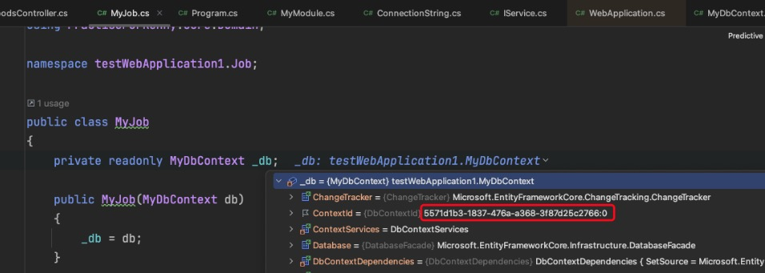
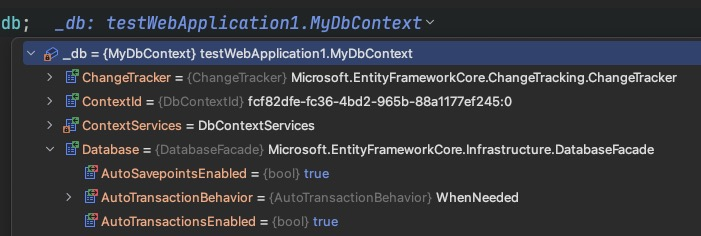
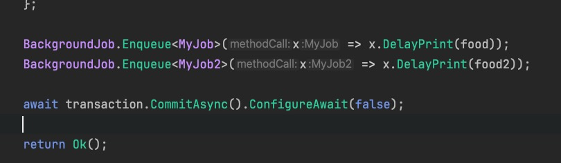

#### 创建一个测试应用，测试手动开启事务对hangfire任务的影响

测试代码：

```c#
[ApiController]
[Route("api/[controller]")]
public class FoodsController : ControllerBase
{
    private readonly MyDbContext _db;

    public FoodsController(MyDbContext db)
    {
        _db = db;
    }

    [Route("foods"), HttpGet]
    public async Task<IActionResult> GetAllFoodsAsync([FromQuery] FoodRequest request)
    { 
        await using var transaction =  await _db.Database.BeginTransactionAsync();
        
        try
        {
            var food = new Foods
            {
                Id = request.Id,
                Name = request.Name,
                Color = request.Color
            };
            
            BackgroundJob.Enqueue<MyJob>(x => x.DelayPrint(food));
            
            await transaction.CommitAsync().ConfigureAwait(false);
            
            return Ok();
        }
        catch (Exception e)
        {
            await transaction.RollbackAsync().ConfigureAwait(false);
            throw;
        }
    }
}
```

任务类：

```c#
public class MyJob
{
    private readonly MyDbContext _db;

    public MyJob(MyDbContext db)
    {
        _db = db;
    }

    [AutomaticRetry(Attempts = 1)]
    public void DelayPrint(Foods food)
    {
        Thread.Sleep(5000);
        _db.Set<Foods>().Add(food);
        
        throw new Exception("模拟抛出异常");
        
        _db.SaveChanges();
        
        Console.WriteLine("task exit!");
    }
}
```


事务是基于DbContext的，当前项目DbContext生命周期是LifeTimeScope

任务中注入的DbContext



执行入队操作的类中的DbContext


随后每次任务重试，发现DbContext使用的都是同一个，但其实这是hangfire实例任务类时创建的DbContext，只是因为LifeTimeScope导致看起来同一个DbContext，与用户请求进来时创建的DbContext不一样，执行定时任务时，Controller中开启的事务已经提交

任务中之所以会回滚，是因为EFcore默认为调用了saveChanges的当前DbContext开启了事务，将saveChanges当前行的前面所有更改提交

如果多次调用saveChanges，期间抛出异常也会导致数据不一致

详见DbContext实例中的AutoTransactionBehavior变量中的WhenNeeded注释




#### 测试多个hangfire任务的事务一致性



模拟MyJob抛出异常 MyJob2成功插入数据库

查看事务是否回滚

查看hangfire控制台可以看到，MyJob任务执行失败，MyJob2执行成功，只有MyJob2有数据

此时如果设置了重试次数MyJob进入重试队列，只有重试成功才能保证数据一致性

此时证明在两个任务入队的上下文开启事务，不能保证抛出异常时两个任务操作的回滚


#### 修改测试代码继续测试

```c#
using var transaction = _db.Database.BeginTransaction();

try
{
    food.Name = food.Name + "1";
    _db.Set<Foods>().Add(food);
    _db.SaveChanges();
    
    Thread.Sleep(1000);

    throw new Exception("模拟抛出异常");

    food.Name = food.Name + "2";
    _db.Set<Foods>().Add(food);
    _db.SaveChanges();

    Console.WriteLine("MyJob task exit!");
    
    transaction.CommitAsync().ConfigureAwait(false);
}
catch (Exception e)
{
    transaction.RollbackAsync().ConfigureAwait(false);
  
    Console.WriteLine(e);
  
    throw;
}
```

断点打到Thread.Sleep(1000);时，

执行完毕，发现没有在任务中开启事务的MyJob2成功插入

MyJob任务调用了1次SaveChanges但数据没有插入，说明手动开启事务，SaveChanges调用不会再自动创建事务并提交，手动开启事务时，多次调用SaveChanges没有意义


修改MyJob2也手动开启事务进行测试：

断点打到Thread.Sleep(1000);时，

执行完毕，MyJob2成功插入了，不打断点执行也是MyJob2插入成功

由于MyJob2不会抛出异常，catch块中的回滚方法不会执行


将controller中手动开启的事务注释调再测试：

仍然只有MyJob2数据成功插入


##### 总结

controller中开启的事务对入队的两个任务没有影响，各个任务中抛出异常只会回滚自己当前任务的操作，没有传递性

如果多个任务执行，其中一个任务失败会导致数据不一致，则不考虑把逻辑放到任务中执行
